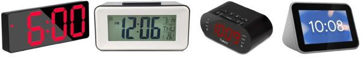

# About this Project
{: .no_toc }

---

  

## The Problem

My nightstand had reached a state of "technological junk-drawer." Between the standalone clock, the lamp, the remote for an LED strip, and a tangled web of charging cables, it looked less like a bedroom and more like the bargain bin at a 1998 RadioShack&trade;. I needed one device to rule them all—or at least one that didn't require a search-and-rescue team to find the "Snooze" button at 6:00 AM.  

Most retail devices also suffered from at least one or more of the following issues:

* **Display Issues:** Screens were often too bright for a dark bedroom, or the digits were too small to read at night without glasses.
* **Audio Issues:** Jarring buzzers or beeps with no volume control made for a stressful wake-up experience.
* **Lack of Control:** Until recently, most systems offered no way to integrate with modern smart home automation.

For the lighting, I needed a true "night light" mode—dim enough for middle-of-the-night trips without ruining night vision, yet bright enough for reading. I also wanted to eliminate the clutter of multiple power cables needed to charge devices every night.

This project is the result of those requirements: an all-in-one system I call the **Ultimate Bedside Lamp**.

---

## Project Goals
This build was designed to address my specific pain points while adding several modern features:

* **Integrated Hardware:** A single device providing lighting, clock, and alarm functions.
* **Versatile Lighting:** Uses an RGBW bulb and an LED strip for "Normal" and "Night" modes.
* **High-End Display:** Auto-dimming screen with configurable fonts and sizes.
* **Advanced Alarms:**
    * Multiple simultaneous alarms and long-term scheduling.
    * **Gentle Wake:** Audio starts quietly and slowly increases in volume.
    * Selectable tracks and customizable snooze (0–60 minutes).
* **Smart Integration:** Control via Web App, Touch Panel, or _optionally_ via **Home Assistant**.
* **Local Control:** Operates fully over Wi-Fi with only optional external data use.

---

## Caveats and Hardware Support
This system was built for my specific needs. The firmware is tightly coupled with the hardware components selected.

**⚠️ Technical Requirement** The touch panel utilizes the [TFT_eSPI](https://github.com/Bodmer/TFT_espi) library. To use a display different than mine, you must define your specific display in the library's configuration, which requires compiling and flashing your own version of the firmware.
{: .note }

The [written guide](https://resinchemtech.blogspot.com/2026/04/ultimate-bedside-lamp.html) includes a detailed parts list indicating which components are interchangeable and which will require code modifications.

**I do not have the bandwidth to maintain multiple versions of the firmware for different hardware combinations. Please do not submit issues requesting support for alternate hardware.**
{: .label .label-yellow }

### Questions?
If you can't find an answer here or in the companion [Build Guide](https://resinchemtech.blogspot.com/2026/04/ultimate-bedside-lamp.html), please post your question in the [Discussion](https://github.com/Resinchem/Ultimate-Bedside-Lamp/discussions) are of the repository.  I will do my best to provide guidance as time allows.

  <a href="{{ '/' | relative_url }}" class="btn btn-outline"><- Previous: Welcome</a>
  <a href="{{ '/concepts' | relative_url }}" class="btn btn-purple">Next: Concepts & Terminology-></a>

