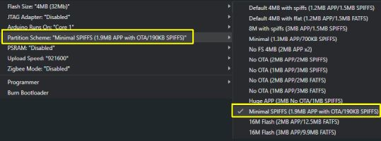

# Advanced Technical Information
<div align="center">


</div>

These sections contain some of the more technical details of the system.  This information is generally not needed for setup, configuration or use of the system.  Instead, it is provided primarily for those that are looking to modify the firmware or to alter this build for their own projects.

The technical information is broken out by the following topics:
- [File and Firmware Structure Layout](#files)
- [Configuration Files](#configfiles)
- [Fonts and the TFT-eSPI Display Library](#fonts)
- [Firmware Size and Partitions](#partitions)

Recall that if you opt to modify the firmware for your specfic needs, ***you are on your own***!  I'm happy to answer question about the official firmware, but I do not have the capacity to develop or support custom modfications.


## File and Firmware Structure<a id='files'></a>
Recall from the [Concepts and Terminology](/concepts.md) section, the system uses three different ESP controllers.


Each of the three controllers has its own firmware, although this repository only provides the firmware for the two ESP32-based controllers.

### Kauf RGBW Light Bulb
The Kauf light bulb comes with a special version of ESPHome pre-installed from the factory.  This is the firmware that is expected and used by the lamp system.  If you replace this firmware (say with Tasmota), the the system will not work without modifying the firmware of the other controllers.

Any firmware updates will be provided by the manufacturer.  This project was develop and testing using Kauf firmware version 1.962(y) with ESPHome 2025.9.2.  It is possible that future updates of either the bulb's firmware or the ESPHome API may break functionality.  If you find this is the case, please open an issue and I will attempt to fix the firmware as long as you have not made any other modifications.

See the following for more information on the Kauf firmware:
[Kauf General Information](https://github.com/KaufHA/common)
[Kauf RGBWW Firmware](https://github.com/KaufHA/kauf-rgbww-bulbs)

### Primary Controller
The primary ESP32 controller's firmware consists of two separate source files:
- **bedside_lamp.ino**: This is the main source code
- **html.h**: Header file that contains most of the HTML and Javascript for the web app

Compiled versions (.bin) of the primary controller in the firmware releases will be called **primary_vx.xx.bin**, where x.xx is the version (e.g. _primary_v0.39.bin_).  The compiled binary file contains all the necessary files (.ino and html) so you just need to flash this single file to your ESP32.

### Display Controller
The display controller's firmware consists of _three_ separate souce files:
- **bl_display.ino**: This is the main source code
- **html.h**: Header file that contains most of the HTML and Javascript for the web app
- **icons20pt7b.h**: Header file that defines a special font with icons.  Used by the display

Like the primary version, the compiled binary contain all the necessary files in one so you will not need to flash multiple files.  The binary file will be called **display_vx.xx.bin**, where x.xx represents the current version number (e.g. _display_v0.54.bin_)

<div style="background-color: yellow; color: black;padding-left: 1em; width: 15%;">

⚠&nbsp;**WARNING**:<br> 
</div>

Do not mix up the primary and display files! When performing initial installation or updates, verify that you are installing the correct firmware to the right controller.  If you try to install the wrong firmware to a controller, it will likely reneder the system unusuable and may require manual flashing via USB to restore normal operation.

### Configuration Files<a id='configfiles'></a>

Both the primary and display controllers contain configuration files.  The configuration files are written and read from the SPIFFS area of the ESP32's memory and the contents are maintained between power cycles or reboots.  The configuration files contain saved settings, including system interface information, default starting values and more.  While it is possible to manually access and modify these files using a utility, it is recommended that the web application be used to change any settings.  Improper direct modification of a configuration files may render the system unbootable.

***<u>Primary Controller***</u><br>

#### Main Configuration (config.json)

The main configuration file contains most of the system interfaces (used to "speak" to the other controllers, and optionally external systems, such as a weather source) along with start-up preferences (e.g. bulb and LED strip colors, touch sensor functions, etc.).  This is an example of a config.json file for the primary controller:
```
{
  "boot_delay": 0,
  "device_name": "BedsideLampDev",
  "led_count": 40,
  "led_state": 0,
  "led_brightness": 119,
  "led_color": "#00ff00",
  "led_effect": 0,
  "led_effect_color1": "#FF0000",
  "led_effect_color2": "#00FF00",
  "led_effect_color3": "#0000FF",
  "use_boot_lights_led": 1,
  "bulb_addr_1": 192,
  "bulb_addr_2": 168,
  "bulb_addr_3": 1,
  "bulb_addr_4": 52,
  "bulb_name": "bedside_lamp_bulb",
  "bulb_state": 0,
  "bulb_color_mode": 1,
  "bulb_color": "#ff0000",
  "bulb_temp": 288,
  "bulb_brightness": 130,
  "use_boot_lights_bulb": 1,
  "touch1_enabled": 1,
  "touch1_duration": 500,
  "touch1_control_1": 1,
  "touch1_control_2": 1,
  "touch2_enabled": 1,
  "touch2_duration": 500,
  "touch2_control_1": 2,
  "touch2_control_2": 2,
  "disp_addr_1": 192,
  "disp_addr_2": 168,
  "disp_addr_3": 1,
  "disp_addr_4": 51,
  "disp_brightness": 128,
  "disp_auto_dim": 0,
  "disp_dim_bright_max": 0,
  "disp_dim_light_1": 0,
  "disp_dim_bright_12": 0,
  "disp_dim_light_2": 0,
  "disp_dim_bright_23": 0,
  "disp_dim_light_3": 0,
  "disp_dim_bright_min": 0,
  "mqtt_addr_1": 192,
  "mqtt_addr_2": 168,
  "mqtt_addr_3": 1,
  "mqtt_addr_4": 108,
  "mqtt_port": 1883,
  "mqtt_tele_period": 120,
  "mqtt_user": "MQ_user,
  "mqtt_pw": "mqtt_password",
  "mqtt_topic_sub": "bedlamp",
  "mqtt_topic_pub": "bedlamp",
  "temp_units": 13,
  "weather_source": 1,
  "owm_key": "your-api-key-here",
  "own_lat": "39.6642",
  "owm_long": "-86.0242",
  "temp_update_period": 15
}
```
Again, this file is not meant to be directly edited and some keys may not be included depending upon selected configuration.  However, you can view the contents of this file at any time (may be needed for troubleshooting) by using the 'Config Dump' feature of the primary's [Controller Commands](/commands.md)

#### Discovery Configuration (discovery.json)<br>
This file will only be present if you've executed the [Home Assistant MQTT Discovery](/discoverymain.md) process at least once.
```
{
  "devname": "Bedside Lamp",
  "bulb": true,
  "led": true,
  "disp": true,
  "touch": true,
  "alarms": true,
  "diag": true
}
```
It only contains the MQTT device name and which entity groups were selected for the last discovery operation.  Again, it is advised that you do not manually edit this file.  Doing so may lead to duplicate or orphaned entities in Home Assistant the next time the discovery process is executed.  This file is also included in the Config Dump if it exists.

***<u>Display Controller***</u><br>

#### Main Configuration (config.json)
Just like the primary controller, the display controller has its own main configuration file.  And just like the primary controller, these values are loaded at boot time and used to establish communication with the other controllers and also loads default preferences (e.g. display brightness, clock font, etc.)
```
{
  "device_name": "BL_Display01",
  "disp_h": 320,
  "disp_v": 480,
  "disp_rotate": 3,
  "touch_enabled": 1,
  "use_led": 1,
  "brightness": 120,
  "auto_dim": 1,
  "dim_debounce": 2,
  "amb_level_1": 5,
  "amb_level_2": 30,
  "amb_level_3": 40,
  "amb_level_4": 50,
  "dim_bright_1": 3,
  "dim_bright_2": 64,
  "dim_bright_3": 128,
  "dim_bright_4": 191,
  "dim_bright_5": 242,
  "clock_style": 3,
  "clock_size": 3,
  "clock_font": 7,
  "clock_color": "65535 (#ffffff)",
  "hour_format": 12,
  "time_source": 1,
  "time_zone": "EST5EDT,M3.2.0,M11.1.0",
  "ntp_server": "us.pool.ntp.org",
  "ntp_sync_interval": 60,
  "mqtt_time_topic": "cmnd/bedlamp/mqtttime",
  "mqtt_live_time": 1,
  "api_live_time": 0,
  "alarm_sd_card": 1,
  "alarm_sd_track": 18,
  "alarm_vol": 24,
  "alarm_gentle_wake": 1,
  "snooze_time": 1,
  "prim_ip_1": 192,
  "prim_ip_2": 168,
  "prim_ip_3": 1,
  "prim_ip_4": 205,
  "mqtt_addr_1": 192,
  "mqtt_addr_2": 168,
  "mqtt_addr_3": 1,
  "mqtt_addr_4": 108,
  "mqtt_port": 1883,
  "mqtt_tele_period": 120,
  "mqtt_user": "MQ_user",
  "mqtt_pw": "mqtt_password",
  "mqtt_topic_sub": "bedlamp",
  "mqtt_topic_pub": "bedlamp",
  "temp_units": 13,
  "weather_source": 1,
  "owm_key": "your-owm-key-here",
  "own_lat": "39.8083",
  "owm_long": "-98.5583",
  "temp_update_period": 15
}
```
This file is not meant to be directly edited and some keys may not be included depending upon selected configuration.  However, you can view the contents of this file at any time (may be needed for troubleshooting) by using the 'Config Dump' feature of the display's [Controller Commands](/commands.md)

#### Alarm File (alarm.bin)
This file tracks current alarms.  Because it is accessed repeatedly during normal operation (as opposed to other types of config files that are normally only loaded once during the boot process), this file is stored in a .bin file.  You can still view the current contents of this file via the Config Dump process, but third-party utilities may not be able to directly read this file.

```
{
  "system_time": "2026-04-10 08:41:37",
  "stored_alarms": [
    {
      "index": 1,
      "active": 0,
      "date": "2026-04-06",
      "time": "09:19",
      "repeat": 0
    },
    {
      "index": 2,
      "active": 0,
      "date": "2026-02-18",
      "time": "11:58",
      "repeat": 4
    },
    {
      "index": 3,
      "active": 1,
      "date": "2026-02-24",
      "time": "14:13",
      "repeat": 9
    },
    {
      "index": 4,
      "active": 1,
      "date": "2026-04-06",
      "time": "07:30",
      "repeat": 5
    },
    {
      "index": 5,
      "active": 0,
      "date": "2025-10-28",
      "time": "07:58",
      "repeat": 7
    }
  ]
}
```
Again, this file not be edited directly.  Changes to alarm should be made via the web app, touch display or other listed method found under [Setting and Editing Alarms](/alarms.md)

#### Sound Library (sounds.json)

This contains your mappings of sound index files to track or title name.  It will show all values as empty until you've completed [Setting up Alarm Sounds](/sounds.md)

```
[
  {
    "index": 1,
    "filename": "0001.mp3",
    "title": "Piano Sonata"
  },
  {
    "index": 2,
    "filename": "0002.mp3",
    "title": "Cool Vibes"
  },
  {
    "index": 3,
    "filename": "0003.mp3",
    "title": "Gentle Waves"
  },
  {
    "index": 4,
    "filename": "0004.mp3",
    "title": "Rise and Shine"
  },
  {
    "index": 5,
    "filename": "0005.mp3",
    "title": "Jazzy Start"
  },
  {
    "index": 6,
    "filename": "0006.mp3",
    "title": "Foggy Mountain"
  },
  {
    "index": 7,
    "filename": "0007.mp3",
    "title": "Jazz Me Up"
  },
  {
    "index": 8,
    "filename": "0008.mp3",
    "title": "Lullaby"
  },
  {
    "index": 9,
    "filename": "0009.mp3",
    "title": "Xylophone Notes"
  },
  {
    "index": 10,
    "filename": "0010.mp3",
    "title": "FX - Beeps"
  },
  {
    "index": 11,
    "filename": "0011.mp3",
    "title": "FX - Low Buzz"
  },
  {
    "index": 12,
    "filename": "0012.mp3",
    "title": "FX - BeBop"
  },
  {
    "index": 13,
    "filename": "0013.mp3",
    "title": "FX - Red Alert"
  },
  {
    "index": 14,
    "filename": "0014.mp3",
    "title": "FX - Buzzer"
  },
  {
    "index": 15,
    "filename": "0015.mp3",
    "title": "FX - High Low"
  },
  {
    "index": 16,
    "filename": "0016.mp3",
    "title": "FX - Rising Bell"
  },
  {
    "index": 17,
    "filename": "0017.mp3",
    "title": "FX - Rooster"
  },
  {
    "index": 18,
    "filename": "0018.mp3",
    "title": "FX - Two Beeps"
  },
  {
    "index": 19,
    "filename": "",
    "title": "empty"
  },
  {
    "index": 20,
    "filename": "",
    "title": "empty"
  }
]
```
Recall that the microSD card may contain up to 255 audio files, but the system will only use the first 20. Again, you can see the raw contents of any of the configuration files by using the [Config Dump](/commands.md)

### Fonts and the TFT_eSPI Library<a id='fonts'></a>
***This is only applicable to the display controller***<br>

<u>_Font File_</u><br>
To provide the different font styles and sizes, and to display many of the icons shown on the touch panel display, a special font files is included (icons29pt7b.h).  When working directly with the provided .bin fles, you don't need to concern yourself with the font file.  It is included in the compiled binary.  However, if you are working with the source code or modifying the firmware for your own needs, this font file needs to be _#included_ at the top of the source code.

`#include "icons20pt7b.h"`

<u>_TFT_eSPI Library_</u><br>
To display text and graphics on the touch display, the display controller's source utilizes the imported [TFT_eSPI Library](https://github.com/Bodmer/TFT_espi).  However, the display **must** be configured and defined within a special config file of the library.  This is why substitution of a different display (even other versions of the Cheap Yellow Display) will likely require manual modification of the user configuration within the TFT_eSPI libary, followed by a compilation and flashing of this modified firmware.  In many cases, additional portions of the display (and possibly the primary) controller's firmware may require modification.

<div style="color: yellow;">

**I CANNOT SUPPORT VERSIONS OF THE FIRMWARE FOR HARWARE COMPONENTS OTHER THAN THOSE LISTED IN THE BUILD GUIDE!**<br>  
</div>
Please do not request modifications for other hardware versions.  If you wish to use another display (or any other hardware), then the modifications necessary to the library and firmware source code are left to the reader.

### Firwware Size and Partitions<a id='partions'></a>

_This information is only applicable if you are manually flashing source code via the Arduino IDE or other uttility_.  It is applicable to both the primary and display controller's firmware.  You do not have to worry about partitions when flashing a provided compiled .bin file.

Due to the size and complexity of the firmware, it is too large to fit in a "standard" partition of the ESP32.  However, since the space normally reserved for SPIFFS is much larger than needed for the small configuration files, some of this space can be _stolen_ or used for the primary sektch.

<u>_Arduino IDE_</u><br>
When using the Arduino IDE for flashing the source or your own modified version of the firmware, you should set the partition size as follows:



Failure to changes partitions from the 'default' will likely lead to an error message the the firmware is too large to fit in the available space.

<u>_Other Utilities_</u><br>
If using a different IDE/flashing utility, then the partition sizes should be defined as follows:

|Partition Name|Type|Subtype|Offset|Size
|----|----|----|----|----
|nvs|data|nvs|0x9000|0x5000 (20KB)
|otadata|data|ota|0xe000|0x2000 (8KB)
|app0|app|ota_0|0x10000|0x1E0000 (1.875MB)
|app1|app|ota_1|0x1F0000|0x1E0000 (1.875MB)
|spiffs|data|spiffs|0x3D0000|0x30000 (~190KB)


