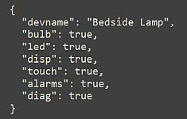

# Configuration Files
{: .no_toc }

---

<p align="center">
  
</p>

Both the Primary and Display controllers utilize specialized configuration files to store your settings. These files are written to and read from the SPIFFS (Serial Peripheral Interface Flash File System) area of the ESP32's memory, ensuring your preferences—from Wi-Fi credentials to alarm schedules—are preserved across reboots and power cycles.  The system uses the LittleFS format for these files.

> **⚠️ A Note on Manual Editing**<br>While these files are accessible via certain third-party utilities, **manual modification is not recommended.** A single missing comma or a stray bracket in a JSON file can prevent the controller from booting. If you need to troubleshoot, use the "Config Dump" feature in the [Controller Commands]({{ '/commands' | relative_url }}) menu to view the raw data safely.
{: .warning }

## Primary Controller Files

### 1. Main Configuration (`config.json`)
This is the master configuration file for the Primary controller. It stores system interfaces, startup preferences, and integration keys.

_Example primary config.json file_

```json
{
  "boot_delay": 0,
  "device_name": "BedsideLampDev",
  "led_count": 40,
  "led_state": 0,
  "led_brightness": 119,
  "led_color": "#00ff00",
  "led_effect": 0,
  "led_effect_color1": "#FF0000",
  "led_effect_color2": "#00FF00",
  "led_effect_color3": "#0000FF",
  "use_boot_lights_led": 1,
  "bulb_addr_1": 192,
  "bulb_addr_2": 168,
  "bulb_addr_3": 1,
  "bulb_addr_4": 52,
  "bulb_name": "bedside_lamp_bulb",
  "bulb_state": 0,
  "bulb_color_mode": 1,
  "bulb_color": "#ff0000",
  "bulb_temp": 288,
  "bulb_brightness": 130,
  "use_boot_lights_bulb": 1,
  "touch1_enabled": 1,
  "touch1_duration": 500,
  "touch1_control_1": 1,
  "touch1_control_2": 1,
  "touch2_enabled": 1,
  "touch2_duration": 500,
  "touch2_control_1": 2,
  "touch2_control_2": 2,
  "disp_addr_1": 192,
  "disp_addr_2": 168,
  "disp_addr_3": 1,
  "disp_addr_4": 51,
  "disp_brightness": 128,
  "disp_auto_dim": 0,
  "disp_dim_bright_max": 0,
  "disp_dim_light_1": 0,
  "disp_dim_bright_12": 0,
  "disp_dim_light_2": 0,
  "disp_dim_bright_23": 0,
  "disp_dim_light_3": 0,
  "disp_dim_bright_min": 0,
  "mqtt_addr_1": 192,
  "mqtt_addr_2": 168,
  "mqtt_addr_3": 1,
  "mqtt_addr_4": 108,
  "mqtt_port": 1883,
  "mqtt_tele_period": 120,
  "mqtt_user": "MQ_user",
  "mqtt_pw": "mqtt_password",
  "mqtt_topic_sub": "bedlamp",
  "mqtt_topic_pub": "bedlamp",
  "temp_units": 13,
  "weather_source": 1,
  "owm_key": "your-api-key-here",
  "own_lat": "39.8098",
  "owm_long": "-98.5551",
  "temp_update_period": 15
}

```

### 2. Discovery Configuration (`discovery.json`)
This file is generated only after running the [Home Assistant Discovery]({{ '/discoverymain' | relative_url }}) process. It tracks which entity groups are currently exposed to your smart home hub.

_Example discovery.json file_
```json
{
  "devname": "Bedside Lamp",
  "bulb": true,
  "led": true,
  "disp": true,
  "touch": true,
  "alarms": true,
  "diag": true
}
```

---

## Display Controller Files

### 1. Main Configuration (`config.json`)
Similar to the primary unit, the display controller stores its hardware-specific preferences and communication settings here.

_Example display config.json file_
```json
{
  "device_name": "BL_Display01",
  "disp_h": 320,
  "disp_v": 480,
  "disp_rotate": 3,
  "touch_enabled": 1,
  "use_led": 1,
  "brightness": 120,
  "auto_dim": 1,
  "dim_debounce": 2,
  "amb_level_1": 5,
  "amb_level_2": 30,
  "amb_level_3": 40,
  "amb_level_4": 50,
  "dim_bright_1": 3,
  "dim_bright_2": 64,
  "dim_bright_3": 128,
  "dim_bright_4": 191,
  "dim_bright_5": 242,
  "clock_style": 3,
  "clock_size": 3,
  "clock_font": 7,
  "clock_color": "65535 (#ffffff)",
  "hour_format": 12,
  "time_source": 1,
  "time_zone": "EST5EDT,M3.2.0,M11.1.0",
  "ntp_server": "us.pool.ntp.org",
  "ntp_sync_interval": 60,
  "mqtt_time_topic": "cmnd/bedlamp/mqtttime",
  "mqtt_live_time": 1,
  "api_live_time": 0,
  "alarm_sd_card": 1,
  "alarm_sd_track": 18,
  "alarm_vol": 24,
  "alarm_gentle_wake": 1,
  "snooze_time": 1,
  "prim_ip_1": 192,
  "prim_ip_2": 168,
  "prim_ip_3": 1,
  "prim_ip_4": 205,
  "mqtt_addr_1": 192,
  "mqtt_addr_2": 168,
  "mqtt_addr_3": 1,
  "mqtt_addr_4": 108,
  "mqtt_port": 1883,
  "mqtt_tele_period": 120,
  "mqtt_user": "MQ_user",
  "mqtt_pw": "mqtt_password",
  "mqtt_topic_sub": "bedlamp",
  "mqtt_topic_pub": "bedlamp",
  "temp_units": 13,
  "weather_source": 1,
  "owm_key": "your-owm-key-here",
  "own_lat": "39.8083",
  "owm_long": "-98.5551",
  "temp_update_period": 15
}

```

### 2. Alarm File (`alarm.bin`)
Because the system checks the alarm schedule multiple times per minute, this data is stored in a binary format for high-speed access. When viewed via a "Config Dump," the system translates the binary data into the following JSON format:

_Example alarm.bin config file_
```json
{
  "system_time": "2026-04-10 08:41:37",
  "stored_alarms": [
    {
      "index": 1,
      "active": 0,
      "date": "2026-04-06",
      "time": "09:19",
      "repeat": 0
    },
    {
      "index": 2,
      "active": 0,
      "date": "2026-02-18",
      "time": "11:58",
      "repeat": 4
    },
    {
      "index": 3,
      "active": 1,
      "date": "2026-02-24",
      "time": "14:13",
      "repeat": 9
    },
    {
      "index": 4,
      "active": 1,
      "date": "2026-04-06",
      "time": "07:30",
      "repeat": 5
    },
    {
      "index": 5,
      "active": 0,
      "date": "2025-10-28",
      "time": "07:58",
      "repeat": 7
    }
  ]
}

```

### 3. Sound Library (`sounds.json`)
This file contains the mapping of your microSD card files to the friendly titles shown in the web app and on the touch display.

_Example sounds.json file_
```json
[
  {
    "index": 1,
    "filename": "0001.mp3",
    "title": "Piano Sonata"
  },
  {
    "index": 2,
    "filename": "0002.mp3",
    "title": "Cool Vibes"
  },
  {
    "index": 3,
    "filename": "0003.mp3",
    "title": "Gentle Waves"
  },
  {
    "index": 4,
    "filename": "0004.mp3",
    "title": "Rise and Shine"
  },
  {
    "index": 5,
    "filename": "0005.mp3",
    "title": "Jazzy Start"
  },
  {
    "index": 6,
    "filename": "0006.mp3",
    "title": "Foggy Mountain"
  },
  {
    "index": 7,
    "filename": "0007.mp3",
    "title": "Jazz Me Up"
  },
  {
    "index": 8,
    "filename": "0008.mp3",
    "title": "Lullaby"
  },
  {
    "index": 9,
    "filename": "0009.mp3",
    "title": "Xylophone Notes"
  },
  {
    "index": 10,
    "filename": "0010.mp3",
    "title": "FX - Beeps"
  },
  {
    "index": 11,
    "filename": "0011.mp3",
    "title": "FX - Low Buzz"
  },
  {
    "index": 12,
    "filename": "0012.mp3",
    "title": "FX - BeBop"
  },
  {
    "index": 13,
    "filename": "0013.mp3",
    "title": "FX - Red Alert"
  },
  {
    "index": 14,
    "filename": "0014.mp3",
    "title": "FX - Buzzer"
  },
  {
    "index": 15,
    "filename": "0015.mp3",
    "title": "FX - High Low"
  },
  {
    "index": 16,
    "filename": "0016.mp3",
    "title": "FX - Rising Bell"
  },
  {
    "index": 17,
    "filename": "0017.mp3",
    "title": "FX - Rooster"
  },
  {
    "index": 18,
    "filename": "0018.mp3",
    "title": "FX - Two Beeps"
  },
  {
    "index": 19,
    "filename": "",
    "title": "empty"
  },
  {
    "index": 20,
    "filename": "",
    "title": "empty"
  }
]
```

**🔍 Additional MP3 Files**<br>Recall that the MP3 Player supports up to 255 files, but only the first 20 physical files are available to use as the alarm sound.  For this reason, files beyond the first twenty are not included in the sounds configuration file.
{: .note }


<div style="display: flex; justify-content: space-between; align-items: center; margin-top: 40px; border-top: 1px solid #333; padding-top: 20px;">
  <a href="{{ '/advancedstructure' | relative_url }}" class="btn btn-outline"><- Previous: Firmware and File Structure</a>
  <a href="{{ '/advanceddisplay' | relative_url }}" class="btn btn-purple">Next: Display Library and Fonts -></a>
</div>