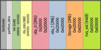

# Partitions and Flashing
{: .no_toc }

---

  

This information is critical if you are manually flashing source code via the Arduino IDE or a third-party utility. If you are simply using the web-based "Firmware Upgrade" feature with the provided `.bin` files, the system handles the memory offsets for you. However, for the developers out there, here is how we manage the "real estate" inside the ESP32.

### The "Sketch Too Large" Problem
Due to the complexity of the firmware and the inclusion of the web application strings, the binary is too large to fit into a standard ESP32 partition. To solve this, we "borrow" space normally reserved for the SPIFFS (the local file system). Since our configuration files are tiny JSON strings, we can safely shrink the SPIFFS area and give that extra room to the primary sketch.

---

### Arduino IDE Configuration
When using the Arduino IDE to compile and flash the source code, you **must** change the partition scheme from the "Default" setting. Failure to do this will result in a compilation error stating that the firmware is too large for the available space.

In the **Tools** menu, ensure your settings match the following:

* **Board:** `ESP32 Dev Module`
* **Partition Scheme:** `Minimal SPIFFS (1.9MB APP with OTA/190KB SPIFFS)`

---

### Manual Partition Table
If you are using a different IDE or a specialized flashing utility (like the Espressif Download Tool), you will need the specific memory offsets and sizes. If these aren't set correctly, the ESP32 will likely fall into a "boot loop" as it tries to find its code in the wrong neighborhood.

| Partition Name | Type | Subtype | Offset | Size |
| :--- | :--- | :--- | :--- | :--- |
| **nvs** | data | nvs | `0x9000` | `0x5000` (20KB) |
| **otadata** | data | ota | `0xe000` | `0x2000` (8KB) |
| **app0** | app | ota_0 | `0x10000` | `0x1E0000` (1.875MB) |
| **app1** | app | ota_1 | `0x1F0000` | `0x1E0000` (1.875MB) |
| **spiffs** | data | spiffs | `0x3D0000` | `0x30000` (~190KB) |

> **💡 Fun Fact** By using this "Minimal SPIFFS" layout, we still have two identical `app` slots (OTA0 and OTA1). This is what allows a controller to perform a "Safe Update"—it downloads the new firmware into the empty slot and only switches over if the download is successful. It’s like wearing a belt and suspenders at the same time!
{: .note }

---

  <a href="{{ '/advanceddisplay' | relative_url }}" class="btn btn-outline"><- Previous: Display Library and Fonts</a>
  <a href="{{ '/troubleshooting' | relative_url }}" class="btn btn-purple">Next: Troubleshooting -></a>

