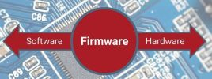

# Firmware and File Structure
{: .no_toc }

---

  

As detailed in the [Concepts and Terminology]({{ '/concepts' | relative_url }}) section, this system distributed its logic across three different ESP-based controllers. Understanding how these files are structured is essential for anyone looking to compile the source code or verify their installation.

  

---

### 1. Kauf RGBW Light Bulb
The light bulb arrives from the factory with a specialized version of **ESPHome** firmware. This project is built specifically to interface with that factory firmware.

* **Compatibility:** This system was developed and tested using Kauf firmware version **1.962(y)** with ESPHome **2025.9.2**. 
* **Modifications:** If you replace this firmware (e.g., with Tasmota), the Lamp's Primary controller will lose its ability to "speak" to the bulb unless you rewrite the light control logic in the Primary firmware.
* **Updates:** Firmware updates for the bulb are handled by the manufacturer. You can find more details at the [Kauf RGBWW GitHub](https://github.com/KaufHA/kauf-rgbww-bulbs).

---

### 2. Primary Controller
The Primary ESP32 acts as the "brain" for logic and external integrations. When working with the source code, the firmware consists of two primary files:

* **`bedside_lamp.ino`**: The main C++ source code containing the logic, MQTT handling, and hardware control.
* **`html.h`**: A critical header file containing the entire web application (HTML, CSS, and JavaScript) as embedded strings.

**Release Binary:** `Primary_Ctrl_vx.xx.bin`  
*(This single file contains the compiled output of both the .ino and .h files.)*

---

### 3. Display Controller
The Display ESP32 handles the touch interface, the clock, alarms, and the audio playback. Its source structure includes:

* **`bl_display.ino`**: The core logic for screen rendering and touch response.
* **`html.h`**: The web interface for display-specific settings (like audio library management).
* **`icons20pt7b.h`**: A specialized header file defining the custom font used for the icons shown on the touch panel.

**Release Binary:** `Display_Ctrl_vx.xx.bin`  
*(This single file contains the compiled output of all three source files.)*

---

> **⚠️ The "Don't Cross the Streams" Warning**
> While the files look similar, the pin mappings and logic are fundamentally different. **Never** attempt to flash the Primary firmware to the Display controller or vice versa. Doing so won't just fail; it will likely lock up the controller so hard it will require a manual USB recovery and a very patient afternoon. Verify your file names twice before clicking that "Update" button!
{: .warning }

---

  <a href="{{ '/advanced' | relative_url }}" class="btn btn-outline"><- Previous: Advanced Tech Info</a>
  <a href="{{ '/advancedconfig' | relative_url }}" class="btn btn-purple">Next: Configuration Files -></a>

