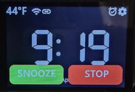
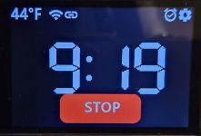

# Responding to Alarms
{: .no_toc }

---

  

The previous sections focused on scheduling and activation. This section covers the practical side of the system: what to do when the alarm actually sounds.

### Snoozing vs. Stopping
Regardless of which method you use to interact with the hardware, there are two primary responses to an active alarm:

* **Snooze:** Silences the alarm for the duration defined in [Alarm Options and Settings]({{ '/alarmoptions' | relative_url }}). Once the timer expires, the alarm sounds again.
* **Stop:** Permanently cancels the current alarm event. If the alarm is set to repeat (e.g., every Wednesday), it will not sound again until the next scheduled occurrence.

> **💡 Minimum Snooze Requirement** The snooze period must be set to at least **one minute** for these features to function. If your snooze time is set to 0, all snooze-related buttons and functions are disabled.
{: .note }

---

### Method 1: Using the Touch Display
When an alarm sounds, the screen automatically brightens to its **DEFAULT** brightness (if it was previously dimmed). The clock face is updated with dedicated **SNOOZE** and **STOP** buttons.

  

* **To Snooze:** Tap the SNOOZE button. The alarm will stop and the display will keep the STOP button visible in case you decide to cancel the alarm before the snooze expires.

  

* **To Stop:** Tap the STOP button at any time to return the system to normal clock mode.

---

### Method 2: Using the Touch Sensors
If you have [configured your touch sensors]({{ '/touchsensors' | relative_url }}) with "Snooze" and "Stop" as their Alarm Functions, you can respond to the alarm simply by tapping the top of the lamp enclosure.

  

The behavior on the screen remains the same as the touch display method, but there is one critical operational difference during a snooze:

> **⚠️ Sensor Function Reversion** While the alarm is in a **Snooze** state, the touch sensors immediately revert to their **Primary Function** (e.g., toggling the LED strip or light bulb). You **cannot** use the touch sensors to cancel a snoozed alarm early; you must use the touch display or a web command to cancel the alarm before the snooze timer expires.
{: .warning }

---

### Method 3: Using External Systems
For those utilizing smart home hubs or other external systems like Home Assistant, you can snooze or stop alarms via the network.  See [Using MQTT and the API](/integrationmain.md) for complete details.

#### MQTT
Send a command to the `alarmupdate` topic:
* **Topic:** `cmnd/[your-mqtt-topic]/alarmupdate`
* **Payload:** `snooze` or `stop`

#### HTTP API
Post a direct URL to the controller's IP address:
* **Snooze:** `http://[IP]/api?alarmupdate=snooze`
* **Stop:** `http://[IP]/api?alarmupdate=stop`

The results are identical to a physical tap—the hardware will react, and the touch display will update its state accordingly.

---

  <a href="{{ '/alarms' | relative_url }}" class="btn btn-outline"><- Previous: Setting and Editing Alarms</a>
  <a href="{{ '/integrationmain' | relative_url }}" class="btn btn-purple">Next: Using MQTT and the API -></a>

