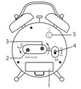
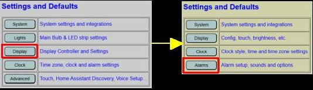
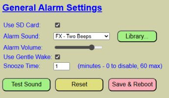
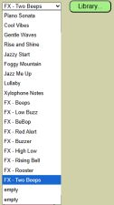

# Alarm Options and Settings

**MPORTANT**: Be sure you've completed the section on [Setting Up Alarm Sounds](/sounds.md) before proceeding.  Without proper sound setup, alarms will not produce any sound.

To access the alarm settings, select Display from the primary web page, followed by 'Alarms'.

The general alarm settings are found at the top of this page.

***Use SD Card*** 
This box must be checked if using the DFPlayer and a microSD card for the sound library.  However, if you are not using alarms or are providing an alternate source for alarm sounds, you can uncheck the box to force the system skip initialization of the player and any sound requests.  When disabled, all other fields are also disabled.

***Alarm Sound*** 
Once you have properly setup your sound library (accessible via the LIBRARY button), up to the first 20 tracks will be shown in a dropdown list.

Simply select the desired sound as your alarm sound.  If you don't recall what a track sounds like, you can use the TEST SOUND button to try it out.  This is described in a bit more detail below.  Note that the selected sound will be used for all alarms, but other sounds can be manually played via optional MQTT or via the HTTP API.

***Alarm Volume*** 
Use the slider to adjust the alarm volume.  If using the Gentle Wake option (described next), the alarm volume will represent the _maximum_ volume that will be played.  Again, you can test the volume via the TEST SOUND button.

***Use Gentle Wake*** 
When enabled, an alarm will initially sound at a quiet volume.  The volume will slowly increase over the period of approximately one minute until the preset alarm volume is reached.  This prevents be awoke to a loud jarring sound.

- **IMPORTANT**: The alarm volume must be set to at least 50% or higher for gentle wake to occur.  If the alarm volume is less than 50%, then the alarm will simply sound at the alarm volume without implementing the gentle wake process.

***Snooze Time*** 
Specify the length of the snooze, in minutes, when snoozing an alarm.  Setting a value of 0 will disable snoozing.  The maximum length of snooze is 60 minutes.

- **IMPORTANT**: When you snooze an alarm, the snooze time is applied _from the moment you snooze the alarm_ and **not** from the original alarm time.
- _Example_: You have a snooze time set for 10 minutes. If your alarm sounds at 6:30 am, but you don't hit the snooze for a full minute (at 6:31 am), then the alarm will sound again at 10 minutes from the snooze point.  In this case, the alarm will sound again at 6:41 am and NOT 10 minutes from the original alarm (which would have been 6:40 am).

***Test Sound Button***
You can use this button to test the select sound, volume and gentle wake selections.  Click the button to start the test.  If Gentle Wake is enabled and the sound volume is at least 50%, the sound will start at a low volume and slowly increase to the sound volume to until reaching the set alarm volume.  Press "STOP TEST" to end a test and return to edit mode.  You can repeat the test multiple times, trying different sound, volume, and gentle wake settings until you find a combination that you like for your alarms.

***Reset Button***
Alarm settings are saved with all the other system configuration settings.  If you have made changes but would like to restore the values to the last saved configuration, just click the RESET button.  Any changes made will be discarded.

***Save and Reboot Button***
Like other configurations covered in earlier sections, your alarm settings are saved to a configuration file.  Click the SAVE & REBOOT button to write the current options to the configuration file.  The controller will then reboot and load your values as the new alarm defaults.

Once you have configured and saved your alarm options, you are ready to start setting and using actual alarms.
