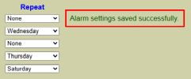
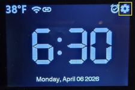
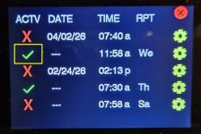
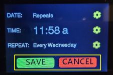

# Setting and Editing Alarms
<div align="center">


</div>

Once you have [Setup your Sound Library](/sounds.md) and [Configured Alarm Options](/alarmoptions.md), you can begin to schedule and use alarms.  There are multiple ways to schedule alarms and I'll list them all here.

### Via the Web Application

The alarm settings are on the same page as the options, again accessible from the primary alarm's main web page by selecting 'Display' and then 'Alarms'


The lower half of this page is where you can set, edit and disable the alarms.


You may define up to five simultaneous alarms.  Not all alarms have to be active.  Each alarm has the following settings:

***Active***<br>
Any alarm can be inactivated (or reactivated) at any time by simply clicking the Active checkbox.  You might use this in a situation where you have an alarm set to go off every weekday morning at the same time.  But then you have a week's vacation and don't want the alarm waking you every morning!  You can simply check the box to deactivate the alarm for your week off and then recheck to enable again when its time to return to work.  Regardless of any other settings, an inactive alarm will never sound.

Note that when you have a non-repeating alarm, after the alarm sounds, the active flag will automatically be unchecked.  This is because a non-repeating alarm will never execute again once the alarm's date and time have passed.  You can re-enable the Active flag, but it has no effect since the alarm date/time are in the past.  So the active flag really applies to repeating events or non-repeating events scheduled in the future.

***Date***<br>
Each alarm will have an initial date.  For repeating alarms (covered below), the date field is simply ignored.  But for non-repeating alarms (those that will only go off once), then the date allows for the alarm to be set for a future date.  You are no longer limited to setting an alarm based on time only.  Using the date field, you can schedule an alarm for a few days, weeks or even months in advance.  For these types of alarms, they will not sound until the time occurs _on the entered date_.  Since a date is required, regardless of alarm type, shortcuts for today & tomorrow are provided to quickly specify a date.  You can click the small calendar icon to pop up a date picker or manually enter the date in mm/dd/yyyy format.

***Time***<br>
Click the small clock icon in the text box to pop open a time picker.  Select your time and am/pm or manually enter it is hh:mm am/pm format.

***Repeat***<br>
You can set up an alarm to repeat on subsequent days.  If repeat is 'None' (default), then the alarm will only sound on the listed date and time.  You select the desired repeat option from the drop down list.  The options are:
- None: Alarm only sounds once, at the alarm's specified time on the listed date.

- Single Day (Mon, Tues, etc.): The alarm will repeat once a week, at the alarm time on the specific day selected.  For example, if you set an alarm for 6:30 am with a repeat of Tuesday, the alarm will sound every Tuesday monrning at 6:30 am.  It will repeat indefinitely unless the 'Active' flag is unchecked.

- Weekdays (M-F): The alarm will sound every weekday (Monday-Friday) at the specified alarm time.  The alarm remains in effect and will continue to sound every weekday until modified or the active flag is cleared.

- Weekends (Sat, Sun): The alarm will sound every Saturday and Sunday at the listed time and as long as the active flag remains checked.

✔ Remember that the alarm date, while required, is **only** used if 'None' is selected for the Repeat mode.  If you select a repeat mode other than None and the date is missing, the current date is used.

***Reload Button***<br>
Alarms are saved in a special alarm file on hte controller.  If you have made unsaved changes and want to reload the previously saved alarms, you can click the RELOAD button.  Any unsaved changes are discarded and the previously saved alarms are reloaded.

***Save Alarms Button***<br>
Click this button to save any changes and to write the current alarm list to the saved alarm file.  You **must click the save button** to commit any changes.  If you make changes and navigate to a different page without saving, then any changes are lost and the previous alarm settings remain in effect.  As a confirmation, when you save changes and they are successfully written to the alarm file, a confirmation message will be shown to the right of the Repeat column:



If there is a problem saving the alarms, an error message will be displayed here instead.  You should always confimred that you have saved any alarm changes and that you see the above message.  This confirms that your alarms have been successfully set as expected.  Note that unlike the primary configuration file, a reboot is not needed after saving the alarms and the saved changes immediately go into effect.

### Via the Touch Panel Display
Assuming you have [enabled touch for your display](/display.md), you can use the touch panel to modify the alarm list. To begin, tap the gear icon on the upper right corner of the display.

<br>
_Standard Display mode_

Note that when you tap the screen, if the current *ACTIVE* brightness is less than the *DEFAULT* brightness, the screen will temporarily brighten to the default value.  Once you are finished and screen returns to the default time, the screen will return to the previous brightness level.

<br>
_Initial Settings Page_

The initial settings page shows controls for the lights and the auto-dim/brightness setting of the display.  These functions are covered elsewhere, but to edit or set alarms, tap the alarm button at the bottom of the page.  To exit the settings page and reutnr to the default time display, tap the red X in the upper right corner.

**NOTE**: If you don't interact with the settings page for approximately 10 seconds, the system will automatically exit the settings, return to the main display and restore the original brightness (if changed).  This occurs because of the next important point.

**IMPORTANT**: When working in the settings, any active alarms ***will not sound***!  Alarms are temporarily disabled during editing so that you can safely change any alarm values.  This is why the settings page automatically exits after ~10 seconds of inactivity.  This assures you don't inadvertently leave the clock on the settings page and miss future alarms.

<br>
_Alarm List Page_

The first alarm page is the alarm listing.  This shows your five available alarm slots, the current settings for each and whether a particular alarm is active or not.

- _Toggling Active State_: To change the active state of any alarm, just click the X or ✔ under the ACTV (active) column.  Tap again to set back to original value.  Changes are applied immediately.

- 

To edit any alarm, tap the gear for the desired alarm.

<br>
_Alarm Edit Page_

From the page, tap the associated gear icon to edit the alarm's date, time and/or repeat. 

**NOTE**: While the date is ignored for repeating alarms, a date must still be entered.  Any date can be used, but since the date is not used for repeating alarms, the date will just be shown as "Repeats" if the repeat setting is anything other then 'None'.

<br>
_Alarm Date, Time and Repeat Edit Pages_

***Date Page***<br>
Simply use the buttons to increase or decrease the month, day and year for the alarm.  Alternatively, tap the TOMORROW button to set the date to the next day.  You can also tweak the date using (+) and (-) after tapping TOMORROW.  This can be a quick shortcut for assisting in setting a date near the current date.

As covered above, the date will be ignored for repeating alarms.  So if you are creating/editing a repeating alarm, the date isn't used.  Just tap the tomorrow button or leave the date as-is.

- _Update Button_: Once you've made your changes, click the UPDATE button to update the date for the alarm you are currently editing.  This will update the date and return to the Alarm Edit page.  **THIS DOES NOT SAVE THE CHANGED ALARM** but just temporarily updates the date of the alarm.  You need to SAVE the alarm from the Alarm Edit page to permanently update the actual alarm.  This is covered below.

- _Cancel Button_: Click this to discard any changes and return the date back to the original value.  The display will return to the Alarm Edit page.

***Time Page***<br>
The Time Edit page works in a similar manner to the Date Page.  Use the (+) and (-) buttons to set the hours and minutes.  Shortcut buttons allow you to directly set the minutes to :00, :15, :30 or :45.  You can then fine tune the minutes if needed via the (+) and (-) buttons.  Be sure to tap AM or PM as appropriate for your alarm.

- _Update Button_: Once you've made your changes, click the UPDATE button to update the time for the alarm you are currently editing.  As mentioned above, this just updates the time for the alarm you are currently editing, but doesn't SAVE the alarm.

- _Cancel Button_: Click this to discard any changes and return the time back to the original value.  The display will return to the Alarm Edit page.

***Repeat Page***<br>
This page is where you select (or clear) the repeat state of the alarm.  Simply tap the repeat option for your alarm.  The selected option will be shown in "inverse" colors.  For example, in the above screen shot, the alarm is set to repeat every Wednesday.

**NOTE**: Currently, you can only select ONE repeat values.  In other words, you cannot select a single alarm to repeat both on Monday and Wednesday.  If you need a repeating alarm for both Monday and Wednesday, currently you have to create two separate alarms... one that repeats every Monday and one that repeats every Wednesday.  This may change in later versions.

**IMPORTANT**: If you are editing an alarm and changing the repeat from one of the day options to "None", be sure to check the alarm date.  Recall that non-repeating alarms also rely on the date.  If you change an existing alarm to "None" and the alarm date is in the past, this alarm will never sound.

- _Update Button_: Once you've made your changes, click the UPDATE button to update the repeat for the alarm you are currently editing.  As mentioned above, this just updates the repeat setting for the alarm you are currently editing, but doesn't SAVE the alarm.

- _Cancel Button_: Click this to discard any changes and return the repeat setting back to the original value.  The display will return to the Alarm Edit page.

***Saving Alarm Changes***<br>
Clicking the UPDATE buttons on the date, time and repeat pages simply updates the alarm you are currently editing, but **doesn't** actually save all the changes nor update the master saved alarm configuration.



To discard any changes you've made to this alarm and revert back to the original alarm settings, simply click the CANCEL button.  Otherwise, once you have edited the date, time and repeat and all values look correct, click the SAVE button.  This will write your updated alarm to the saved master alarm configuration file.  

If any problems occur in writing your alarm changes to the alarm file, an error will be shown on the display:


If this occurs, tap the CONFIRM button to dismiss the error message.  You should then use the web application to verify your alarm settings.  In addition, you can even use the configuration dump controller command to output the actual contents of the saved alarm configuration file.  

Regardless of whether you tap SAVE or CANCEL, the display will return to the alarm listing page.


By default, editing an alarm will automatically activate that alarm.  But on the Alarm Listing page, just assure the active flag is set as desired for your newly edited alarm.  If not, simply tap the  X or ✔ icon to toggle the active state.

💡**REMEMBER**: An inactive alarm will _never_ sound regardless of any other alarm settings.

Use the Red X in the upper right corner to exit the alarm listing page and return to the initial settings page.

### Setting Alarms via External Systems

Alarms can also be modified, activated or even snoozed or stopped by external system via either MQTT or the HTTP API.

***MQTT***<br>
If you have an MQTT broker and have also enabled and configured MQTT for the system, a special JSON payload may be sent to the alarm topic to modify any alarm slot.  

Example:
- Topic: ```cmnd/[your-mqtt-topic]/setalarm```
- Payload: 
```
    {
      "index": 2,
      "active": 1,
      "date": "2026-02-18",
      "time": "11:58",
      "repeat": 4
    }
```

See the [MQTT Setup & Topics](/mqtt.md) section for more details on using MQTT with the system.  Do not try to copy/paste the above example, as your version will be different based on specified MQTT topics.

***HTTP API***
The HTTP API can also be used to set or edit an alarm.  This can be done by posting a specially constructed URL to the IP address of the controller.

Example:
```
http://your-controller-ip/api?setalarm=1&alarmnum=2&date=2026-02-18&time=11:58:00&repeat=4
```
This sets the same alarm as shown in the MQTT example.  See the [HTTP API Command List](/api.md) for more information on using the HTTP API.

These options provide a variety of methods to manage current alarms.  In fact, using an external system like Home Assistant and either MQTT or API, it would be theoretically possible to integrate a calendar in Home Assistant and _automatically_ schedule alarm based on calendar entries.  See the Home Assistant documentation for more information on integrating calendars and creating automations.  Both of these topics are beyond the scope of this particular project.
