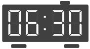
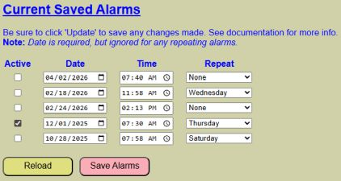
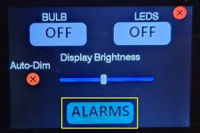
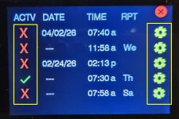
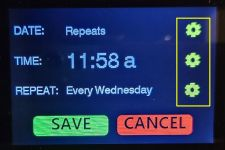
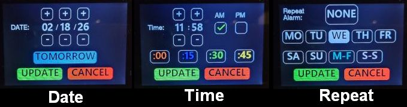

# Setting and Editing Alarms
{: .no_toc }

---

<p align="center">
  
</p>

Once you have [Setup your Sound Library]({{ '/sounds' | relative_url }}) and [Configured Alarm Options]({{ '/alarmoptions' | relative_url }}), you can begin scheduling alarms. There are three primary ways to manage your schedule: the Web App, the Touch Panel, and external system integrations.

---

### 1. Via the Web Application
The alarm scheduling interface is located on the lower half of the **Alarms** page (accessible via the **Display** menu).



You may define up to five simultaneous alarms. Each slot contains the following settings:

* **Active:** Use this checkbox to enable or disable an alarm without deleting its settings. 
    > **💡 Tip: Non-Repeating Alarms**<br>For one-time alarms, the "Active" flag will automatically uncheck itself once the alarm sounds, as the event has passed.
    {: .note }
* **Date:** Required, but only used for one-time (non-repeating) alarms. You can set alarms days, weeks, or months in advance. Click the small calendar icon to display a date picker or manually enter a date in mm/dd/yyyy format.
* **Time:** Click the clock icon to use the time picker. Ensure you select the correct AM/PM toggle. Or manually enter time in hh:mm AM/PM format.
* **Repeat:** Choose from **None**, **Single Day**, **Weekdays (M-F)**, or **Weekends (Sat/Sun)**. Recurring alarms ignore the Date field and run indefinitely until deactivated.
    > **💡 Tip: One-Time vs. Repeating**<br>Setting a repeating alarm is a great way to ensure you don't forget that 7:00 AM Monday meeting. Just remember to check your settings before a holiday! There is a unique kind of morning frustration that comes from being woken up by a perfectly functioning "Weekday" alarm on a Friday you took off for vacation.
    {: .note }

#### Controls
* **RELOAD:** Discards unsaved changes and pulls the current schedule from the controller.
* **SAVE ALARMS:** You **must** click this to commit changes. A confirmation message will appear to the right of the list upon success.
    > **💡 Note: No Reboot Required**<br>Unlike system-level changes, saving alarms takes effect immediately. No controller restart is necessary.
    {: .note }

---

### 2. Via the Touch Panel Display
The touch interface, if enabled, allows you to manage your alarms directly from the bedside. 

1. Tap the **Gear Icon** (⚙) on the main clock display.
2. If the screen is dimmed, the first tap will "wake" the display to its default brightness.
3. Tap the **Alarm Button** at the bottom of the settings menu.



> **❗ HIGH PRIORITY: Alarms Disabled During Edit**<br>For safety and processing stability, **active alarms will not sound** while you are navigating the on-device settings menus. To prevent accidentally missing a future alarm, the settings menu will automatically time out and return to the clock after 10 seconds of inactivity.
{: .important }

#### The Alarm List
The listing page shows all five slots. You can quickly toggle the **ACTV** (Active) state by tapping the **X** or **✔** icons.



#### Editing an Alarm
To modify a specific alarm, tap the **Gear Icon** (⚙) for that slot. This opens the Alarm Edit page.



Edit the Date, Time, and/or Repeat settings by clicking the corresponding **Gear Icon** (⚙).



* **Date/Time Pages:** Use the **(+)** and **(-)** buttons to adjust values. Use the **TOMORROW** or **:00/:15/:30** shortcuts for faster entry.
* **Repeat Page:** Tap the desired frequency. Note that currently, you can only select one repeat value per alarm slot.
   * If you need an alarm that repeats on two different days, say Tuesday and Thursday, currently you must set these up as two different alarms.  This may change in a future update.
   {: .note }
> **⚠️ Important: Saving on Touch**<br>Clicking **UPDATE** within the Date or Time sub-menus only updates the temporary "Edit" screen. You **must** click the final **SAVE** button on the main Alarm Edit page to write the changes to the system memory.
{: .warning }

#### Confirm Saved Alarm
When clicking save from the alarm edit page, your alarm will immediately be saved and made active by default.  But you can tap/toggle the active status from the alarm listing page.  If there are any issues with saving your alarm, the display will show:


> **⚠️ Important:**<br>In the unlikely event you receive the above message, dismiss with the confirm button and use the web application to verify/update your scheduled alarms.
{: .warning }
---

### 3. Via External Systems
For advanced automation (such as syncing with a Home Assistant calendar), alarms can be set via MQTT or the HTTP API. See [Using MQTT and the API](/integrationmain.md) for full details.

#### MQTT
Send a JSON payload to the `setalarm` topic:
* **Topic:** `cmnd/[your-topic]/setalarm`
* **Example Payload:**
```json
{
  "index": 2,
  "active": 1,
  "date": "2026-02-18",
  "time": "11:58",
  "repeat": 4
}
```

#### HTTP API
The HTTP API can also be used to set or edit an alarm by posting a specially constructed URL to the IP address of the controller.

**Example:**
`http://[your-controller-ip]/api?setalarm=1&alarmnum=2&date=2026-02-18&time=11:58:00&repeat=4`

This command sets the same parameters as shown in the MQTT example. See the [API HTTP Command List]({{ '/api' | relative_url }}) for detailed formatting requirements and available parameters.

These integration options provide a variety of methods to manage your schedule. For example, using an external system like Home Assistant, it is theoretically possible to sync the lamp with a personal calendar and automatically schedule alarms based on your appointments. Note that specific Home Assistant automations are beyond the scope of this documentation.

---

<div style="display: flex; justify-content: space-between; align-items: center; margin-top: 40px; border-top: 1px solid #333; padding-top: 20px;">
  <a href="{{ '/alarmoptions' | relative_url }}" class="btn btn-outline"><- Previous: Alarm Options & Settings</a>
  <a href="{{ '/alarmactions' | relative_url }}" class="btn btn-purple">Next: Responding to Alarms -></a>
</div>