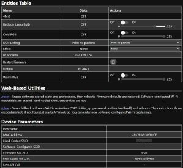

# HTTP API Command List
{: .no_toc }

---

<p align="center">
  
</p>

The API allows for "headless" control of the system via simple HTTP requests. It's essentially a remote control that lives in your browser's address bar or your favorite automation script. Unlike MQTT, the API does not require third-party intermediaries (like a broker) or complex configuration. Commands are issued as standard URLs:

`http://[your-controller-ip]/api?...`

> **💡 IP Routing**<br>For most commands, you can use either the Primary or Display controller's IP address; the firmware handles internal routing automatically. Only the **PING** command must be sent to a specific controller's IP to verify that specific unit.
{: .note }

### Command Chaining
Some commands can be combined into a single HTTP call by concatenating them with an ampersand (`&`). 

**Example:**
`http://[primary-ip-address]/api?ledbrightness=128&ledcolor=ff0000`

Other commands must be sent as the only command in the URL.   

---

### SET Commands
These commands are used to modify the active state of the system. Commands marked **NO** in the "Multi" column must be sent as standalone requests.

| Command | Parameter(s) | Returns | Multi | Example / Notes |
| :--- | :---: | :---: | :---: | :--- |
| `alarmactive` | alarmnum&active=n | OK | **NO** | `/api?alarmactive=2&active=1`<br>Sets active state of specified alarm. |
| `alarmtrack` | number (1-20) | OK | Yes | `/api?alarmtrack=13`<br>Sets the active track for alarm sound. |
| `alarmupdate` | snooze *or* stop | OK | Yes | `/api?alarmupdate=snooze`<br>Snoozes/stops alarm (Ignored if idle). |
| `alarmvolume` | number (0-30) | OK | Yes | `/api?alarmvolume=15`<br>Sets alarm volume (or max for Gentle Wake). |
| `snoozetime` | number (0-60) | OK | Yes | `/api?snoozetime=10`<br>Sets snooze time in minutes. |
| `playalarm` | length (0-60) | OK | Yes | `/api?playalarm=15`<br>Plays current alarm track for X seconds. |
| `setalarm` | *See notes below* | OK | **NO** | Must be the only command sent. |
| `bulbbrightness`| number (0-255) | OK | Yes | `/api?bulbbrightness=128`<br>Sets brightness; toggles bulb ON. |
| `bulbcolor` | RGB *or* Hex | OK | Yes | `/api?bulbcolor=00ff00`<br>Sets color and mode to [rgb]; toggles ON. |
| `bulbstate` | OFF / ON (0/1) | OK | Yes | `/api?bulbstate=ON`<br>Sets bulb power state. |
| `ledbrightness`| number (0-255) | OK | Yes | `/api?ledbrightness=128`<br>Sets LED brightness; toggles strip ON. |
| `ledcolor` | RGB *or* Hex | OK | Yes | `/api?ledcolor=ff00ff`<br>Sets LED color (omit '#'); toggles ON. |
| `ledstate` | OFF / ON (0/1) | OK | Yes | `/api?ledstate=ON`<br>Sets LED strip power state. |
| `clockcolor` | RGB *or* Hex | OK | Yes | `/api?clockcolor=ffffff`<br>Sets color of the clock display (omit '#'). |
| `dispbrightness`| 0-255, up, down | OK | Yes | `/api?dispbrightness=up`<br>Adjusts brightness. *Auto-dim must be OFF.* |
| `autodim` | OFF / ON (0/1) | OK | Yes | `/api?autodim=OFF`<br>Sets the display's auto-dimming state. |
| `settemperature`| number | OK | Yes | `/api?settemperature=72`<br>Source must be MQTT/API. Raw value. |
| `settime` | *See notes below* | OK | **NO** | Applicable only if time source is Manual. |
| `touch1func` | number (0-8) | OK | Yes | `/api?touch1func=1`<br>Sets Sensor 1 primary function (0-8). |
| `touch1funca` | number (0-2) | OK | Yes | `/api?touch1funca=2`<br>Sets Sensor 1 alarm function (0-2). |
| `touch2func` | number (0-8) | OK | Yes | `/api?touch2func=1`<br>Sets Sensor 2 primary function. |
| `touch2funca` | number (0-2) | OK | Yes | `/api?touch2funca=2`<br>Sets Sensor 2 alarm function. |
| `bulbrestart` | 1 | OK | **NO** | `/api?bulbrestart=1`<br>Restarts the RGBW Light bulb. |
| `displayrestart`| 1 | OK | **NO** | `/api?displayrestart=1`<br>Restarts the display controller. |
| `primaryrestart`| 1 | OK | **NO** | `/api?primaryrestart=1`<br>Restarts the primary controller. |
| `restartall` | 1 | OK | **NO** | `/api?restartall=1`<br>Restarts all three controllers. |
| `dispsaveconfig`| 1 | OK | **NO** | **CAUTION:** Saves active as default and reboots. |
| `primsaveconfig`| 1 | OK | **NO** | **CAUTION:** Saves active as default and reboots. |

#### Detailed SET Parameter Notes

**Setting an Alarm**<br>
Requires a specific set of parameters: `/api?setalarm=1&alarmnum=3&date=2026-04-01&time=14:30:00&repeat=7`
* **setalarm**: `0` (Inactive) or `1` (Active).
* **alarmnum**: Slot `1-5`.
* **date**: `YYYY-MM-DD`.
* **time**: `hh:mm:ss` (Seconds required, 24-hour format).
* **repeat**: `0-9` (0=None, 1-7=Days, 8=Weekdays, 9=Weekends).

**Setting the Time**<br>
Requires: `/api?settime=1&mon=4&day=15&yr=2026&hr=14&min=30&sec=0`
* **Source**: Time source must be set to **Manual** for this to persist. Otherwise the next sync will overwrite the set time.
* **Requirements**: All parameters (Month, Day, Year, Hour, Minute, Second) are required.

---

### GET Commands
These commands retrieve data and do not modify settings. They must be sent individually.

| Command | Parameter(s) | Returns | Example / Notes |
| :--- | :---: | :---: | :--- |
| `ping` | 1 | OK | `/api?ping=1`<br>Send to the specific controller IP. |
| `primaryipaddr` | 1 | IP Address | Returns IP of primary controller. |
| `displayipaddr` | 1 | IP Address | Returns IP of display controller. |
| `bulbipaddr` | 1 | IP Address | Returns IP of RGBW light bulb. |
| `primarymac` | 1 | MAC Address | Returns MAC of primary controller. |
| `displaymac` | 1 | MAC Address | Returns MAC of display controller. |

---

### DIRECT Commands
These are shortcut commands typically sent to a specific controller. Note the **omission** of `/api` in the URL.

#### Controller-Specific Direct Calls
| Command | Parameter(s) | Returns | Notes |
| :--- | :---: | :---: | :--- |
| `/restart` | none | Web Page | Reboots the targeted controller. |
| `/restartall` | none | Web Page | Reboots all three units (Primary IP only). |
| `/otaupdate` | none | Web Page | Places targeted unit in OTA Update mode. |

#### RGBW Light Bulb Direct Commands
The bulb uses the ESPHome API base: `http://[bulb-ip]/light/[bulbname]/[command]`

| Command | Parameter(s) | Returns | Notes |
| :--- | :---: | :---: | :--- |
| *empty* | none | JSON | Returns a JSON payload of current state. |
| `/turn_on` | optional | OK | Toggles bulb on with last or new settings. |
| `/turn_off` | none | OK | Turns the light bulb off. |

> **💡 JSON Example: Bulb State**
```json
{
  "id": "light-bedside_lamp_bulb",
  "state": "ON",
  "color_mode": "color_temp",
  "brightness": 198,
  "color_temp": 287
}
```
{: .note }

---

### External Bulb Support

While not utilitized or linked to from the app, the bulb does have its own web interface that can be accessed by simply entering the bulb's IP address in a browser.

<p align="center">
  
</p>

> **❗ Support Disclaimer**<br>The Kauf bulb utilizes its own factory ESPHome firmware. This project makes use of the provided API but does not maintain the bulb's internal firmware. For assistance with the bulb itself, refer to the [Kauf Common Repository](https://github.com/KaufHA/common) or the [Kauf RGBWW Bulb Repository](https://github.com/KaufHA/kauf-rgbww-bulbs).
{: .important }


<div style="display: flex; justify-content: space-between; align-items: center; margin-top: 40px; border-top: 1px solid #333; padding-top: 20px;">
  <a href="{{ '/mqtt' | relative_url }}" class="btn btn-outline"><- Previous: MQTT Setup & Topics</a>
  <a href="{{ '/discoverymain' | relative_url }}" class="btn btn-purple">Next: Home Assistant Discovery -></a>
</div>