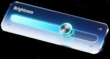
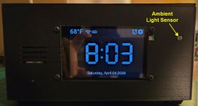
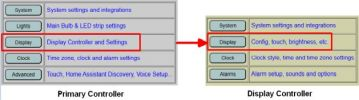
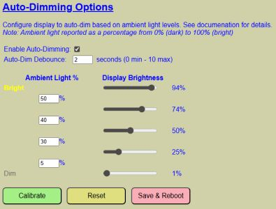
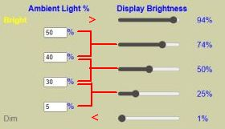
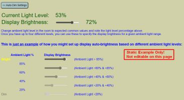

# Auto-Dimming
{: .no_toc }

---

  

The display can be configured to automatically adjust its brightness based on the measured ambient light in the room. Unlike many retail clocks with fixed dimming, this system allows you to define a custom curve by specifying exact ambient light percentages and their corresponding display brightness levels.

  

### Setting Up Auto-Dimming
To configure these settings, return to the **Display Settings** page via the web application. The auto-dim options are located on the lower half of the page.

  

These options define the **DEFAULT** values loaded at boot. You can temporarily override these settings during operation, as covered in [Managing Display Brightness]({{ '/dispbrightness' | relative_url }}).

#### Core Settings
* **Enable Auto-Dimming:** Check this box to activate the feature by default. If unchecked, brightness remains constant at the "Default Brightness" level.
* **Auto-Dim Debounce:** Specifies a delay (0–10 seconds) before a brightness change is applied. 
    > **💡 Performance Hint** Debouncing prevents the display from flickering if a shadow passes over the sensor or a light reflects off the screen. A value of **2–5 seconds** is recommended for a smooth experience.
    {: .note }

#### Ambient Light and Brightness Logic
The system uses a tiered logic to determine brightness. You can specify up to four ambient light thresholds and five brightness levels. 

> **💡 Understanding the Curve** The system evaluates the room brightness from **Highest to Lowest**:
> * If the light is **above** your top threshold (e.g., 50%), the highest brightness (e.g., 94%) is used.
> * If the light falls **between** two thresholds, the lower corresponding brightness is applied.
> * If the light is **below** your minimum threshold (e.g., 5%), the lowest defined brightness is used.
{: .note }

  

---

### Calibration Mode
Because "50% brightness" looks different in every room, the system includes a live calibration tool. 

> **⚠️ Warning** Clicking the **Calibrate** button will discard any unsaved values currently entered on the Auto-Dim settings page. Save your progress before entering calibration.
{: .warning }

  

The calibration page provides a "Live" ambient light reading that updates once per second. To find your ideal settings:
1. Adjust your room lighting (turn on lamps, close curtains, etc.).
2. Observe the measured ambient level.
3. Use the slider to find a display brightness that feels comfortable for that specific light level.
4. **Jot down these pairs** (Ambient % and Display %); they are not saved automatically on this page.

**Note:** The calibration page is a sandbox. Use it to determine your desired values, then return to the Auto-Dim settings page to enter and save them.

>🔍 **The Brightness Balancing Act** Finding the perfect auto-dimming levels is a bit of an art form. You want it bright enough to read during a sunny afternoon, but not so bright that it feels like the sun has decided to move into your bedroom at 3:00 AM. If you find your lamp is constantly flickering between brightness levels, you’ve likely set your thresholds too close together—give the sensor a little breathing room!
{: .note }

---

### Maintenance Actions
* **RESET Button:** Restores all values to the last saved defaults, overwriting any unsaved changes.
* **SAVE AND REBOOT:** Commits your new curve to the configuration file and restarts the controller to apply them as the new system defaults.

---

  <a href="{{ '/display' | relative_url }}" class="btn btn-outline"><- Previous: Display Configuration</a>
  <a href="{{ '/lights' | relative_url }}" class="btn btn-purple">Next: Light Settings -></a>

