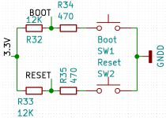
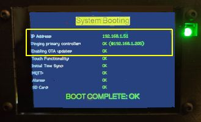

# The Boot Process
{: .no_toc }

---

  

As covered in the [Concepts]({{ '/concepts' | relative_url }}) section, this project consists of three independent controllers communicating via a wireless API. Because they must share configuration parameters at startup, the system uses the display and lights to indicate its progress.

> ### ⚠️ Mandatory Configuration
> The boot process **cannot complete** until you have configured the initial system settings in the web app. The controllers find each other by IP address; if this information is missing, the system will halt. Ensure you have completed the [System Interfaces]({{ '/interfaces' | relative_url }}) setup first.
{: .important }

---

## Visual Boot Indicators

When you power on the system (assuming the "Triumvirate" is linked), the devices follow a specific sequence (you can modify portions of this behavior later):

1.  **RGBW Bulb:** Boots first. The other controllers wait for this step to complete.
2.  **Primary Controller:** * Briefly flashes the **LED Strip** (Red, Green, Blue) to test hardware.
    * Briefly flashes the **RGBW Bulb** (Red, Green, Blue) to test connectivity.
    * Sets both to their default "Start" state (usually Off).
3.  **Display Controller:** Shows a line-by-line status report directly on the screen.

### Understanding the Display Status

| Item | Description |
| :--- | :--- |
| **IP Address** | Shows the Display Controller's IP, confirming it is Wi-Fi connected. |
| **Primary Link** | Connection status to the Primary Controller. It will retry 10 times before failing. |
| **OTA Status** | Confirms if Over-the-Air updates are enabled. |
| **Touch** | Confirms the capacitive touch functionality is initialized. |
| **Clock/Time** | Shows if time has synced via **NTP**, MQTT, or API (requires Internet/Server). |
| **MQTT** | Connection status to your Home Assistant/MQTT broker (Optional). |
| **Alarms** | Confirms the alarm schedule file was found and processed. |
| **SD Card** | Confirms the audio hardware for alarm tracks is ready. |

> ### 💡 Initial Setup Note
> It is **perfectly normal** for several items (Clock, MQTT, Alarms, etc.) to show as **DISABLED** or **FAILED** during your first boot. These will become active once you configure them in the web application.
{: .note }

---

## Technical Details (For Advanced Users)

If you are modifying the firmware or troubleshooting a communication issue, understanding the "Under the Hood" sequence is vital.

### Configuration Sharing
Both the Primary and Display ESP32s have local configuration files for Wi-Fi credentials. However, the Primary Controller acts as the "Master" for global settings (like MQTT brokers and Weather APIs). Once the link is established, the Primary shares these values with the Display so they stay in sync.

### Controller Sequence
* **RGBW Bulb:** Has the lightest firmware and finishes first. Its default state is to return to its last power state, but the Primary Controller will override this once it finishes booting.
* **Primary Controller:** Specifically waits for a "Ping" response from the bulb before proceeding to test the LED strip. It then waits to be pinged by the Display.
* **Display Controller:** Always finishes last. It enters a loop, pinging the Primary every few seconds. Once the Primary is ready and responds, the two exchange configuration data and the Display initializes its sub-systems (SD card, NTP, etc.).

### Automatic Reboots
Because configuration is shared, if you change a setting on the Primary Controller that requires a reboot, the system is designed to automatically trigger a reboot of the Display Controller as well. This ensures that both devices are always using the same set of parameters.

---

With the boot process understood and your initial setup verified, you are ready to explore the [General Use]({{ '/use' | relative_url }}) of your Ultimate Bedside Lamp!