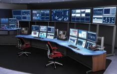
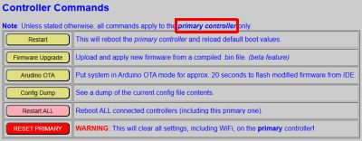
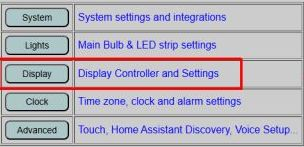
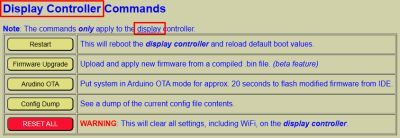

# Controller Commands

When using the web application, touch display or even external applications to inteface with your device, you generally don't have to be concerned about which of the three ESP-based controllers you are working with.  The firmware abstracts this from you and routes control and commands to the proper controller automatically.  However, the one exception to this rule are the controller commands.  These special commands generally ONLY deal with the specific controller where the commands are shown.

So how do you know which controller is which?  There are numerous indicators, including use of a pale gray background color when interfacing with the primary controller and a pale yellow background when interfacing with the display controller.  There are other indicators of which controller is in use and those are covered in the [Web Application Overview](/webapp.md) topic.  I'll also point out a few other indicators below.

Controller commands are used for special features, such as restarting a controller, flashing firmware updates or even completely resetting a controller and wiping out all the settings.

## Primary Controller Commands

These are found at the bottom of the _primary_ controller's web page.  You can verify that you are interacting with the primary controller by the light gray background.  The note right above the commands also serve as a reminder that most of the commands only apply to the **primary** controller.  As an additional indicator, all the 'yellow' buttons issue commands that only appy to or impact the primary controller.

**Restart** 
Click this button to reboot the _primary_ controller.  The other controllers will not be impacted and will continue to operate while the primary controller resets.  Some functions and controls will be unavailable until the controller completes the reboot process and re-establishes communications with the other two controllers.

**Firmware Upgrade** 
Click this to access the Firmware Upgrade page for the _primary_controller.  Updating and installing firmware updates are covered under the separate [Installing Updates](/updates.md) section.  For this particular function, is is critical that you are dealing with the expected controller.  Installing the wrong firmware on the wrong controller will break your system.

**Arduino OTA** 
This will put the _primary_ controller in OTA mode for approximately 20 seconds.  During this window, modified or even the original code can be flashed wirelessly directly from the Arduino IDE.  This is mostly used to apply your own code modifications but in some cases it can also be used to flash the official firmware if flashing by other methods fail.  See [Modifying the Firmware](/modifications.md) and [Using the Arduino IDE](/arduino.md) for more information.

**Config Dump** 
This can be used to dump the contents of the configuration files to the screen.  Mostly this is used for troubleshooting, but allows you to see what your current **DEFAULT** for boot values are for various system features.  These files stored in a special area of the ESP32, called SPIFFS, and are "read-only".  To change any of the values, use the appropriate setting in the web application.  While some utilities may allow you to manually edit these files, this isn't recommended.  Corrupting or creating an invalid configuration file could result in a failure of the system to reboot and require USB flashing and a complete setup again.

For the Primary Display Controller, up to two separate configuration files may be shown:
- Config File:  This is the main configuration file and contains most of the **DEFAULT** starting values that are loaded at boot time.

- Discover File: This will only be present if you have previously run the optional Home Assistant Discovery process.  It keeps track of which entity groups were included (or excluded) from Discovery and the original Discovery device name.  If Discovery has never been run, this file will be empty.  See the [Home Assistant Discovery](/discoverymain.md) topics for more information on adding your device to Home Assistant.

- Restart ALL: _**This command applies to ALL controllers**_. This is the one command that applies to all three controllers.  Clicking this button will reboot the entire system, sending commands to all THREE controllers.  The order and bootup process are controlled and the boot up process is covered under [The Boot Process](/booting.md) section.

- RESET PRIMARY

 

This command must be used with **extreme caution**!  Executing this command will completely wipe ALL configuration data from the PRIMARY controller, _including saved WIFI information_.  In effect, it restores the firmware to the originally installed state.  You will need to complete the [Onboarding](/onboarding.md) and [System Interface](/interfaces.md) processes again.  If the IP address of the primary controller changes, you may also need to reconfigure the interface on the display controller as well.

## Display Controller Commands

All of the display controller commands only impact the **display** controller.  To access the display controller's commands, you must first switch to the display controller.  To do so, just click the 'Display' button from the primary controllers main page.

This will launch the display controller's main page.  The controller commands are found at the bottom of this page.

The command are almost identical to the primary controller's commands except that these apply only to the display controller.

**Restart** 
Click this button to reboot the _display_ controller.  The other controllers will not be impacted and will continue to operate while the display controller resets.  Some functions and controls will be unavailable until the controller completes the reboot process and re-establishes communications with the other two controllers.

**Firmware Upgrade** 
Click this to access the Firmware Upgrade page for the _display_controller.  Updating and installing firmware updates are covered under the separate [Installing Updates](/updates.md) section.  For this particular function, is is critical that you are dealing with the expected controller.  Installing the wrong firmware on the wrong controller will break your system.

**Arduino OTA** 
This will put the _display_ controller in OTA mode for approximately 20 seconds.  During this window, modified or even the original code can be flashed wirelessly directly from the Arduino IDE.  This is mostly used to apply your own code modifications but in some cases it can also be used to flash the official firmware if flashing by other methods fail.  See [Modifying the Firmware](/modifications.md) and [Using the Arduino IDE](/arduino.md) for more information.

**Config Dump** 
Just like the primary controller, this will dump the contents of all the display controller's config files to the screen.  However, the display controller has a few different configuration files.

- Main Config File: This is the primary configuration file with all the display system's **DEFAULT** or starting boot values.

- Alarm File:  This is a dump of the current alarm configuration file.  Until you initially setup and create your alarms, this file may be empty or contain dummy starting values.

- Sound Library:  This is the saved configuration file that matches up track names with file names and also sets the right file with the right physical location (index) of the microSD card.

Just like the primary configuration files, these are not meant to be manually edited and improper changes may render the controller unbootable.

- RESET ALL

 

This command must be used with **extreme caution**!  Executing this command will completely wipe ALL configuration data from the DISPLAY controller, _including saved WIFI information_.  In effect, it restores the firmware to the originally installed state.  You will need to complete the [Onboarding](/onboarding.md) and [System Interface](/interfaces.md) processes again.  If the IP address of the display controller changes, you may also need to reconfigure the system interface on the primary controller as well.

