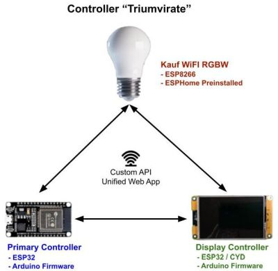
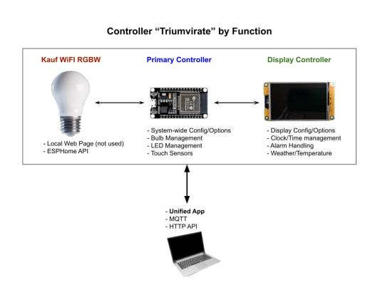

# Concepts and Terminology

To understand how to install, configure and use the firmware and related web application, it is important to understand a bit about how the system is designed, along with a few key terms that will be used throughout this wiki.

More details, including build instructions, can be found in the [written companion guide](https://resinchemtech.blogspot.com/2026/03/ultimate-bedside-lamp.html).

## Controller Triumvirate

The system is actually composed of three separate "controllers" or ESP chips/boards that communicate via a custom API built into the firmware. 

### RGBW WIFI Light bulb
The light bulb contains an embedded ESP8266 chip.  This comes pre-flashed from the factory with a self-contained version of ESPHome.  But this <u>does <b>NOT</b> mean that you need to be a Home Assistant user or install ESPHome to use the bulb or complete the project!</u>  You only need WIFI for full system functionality.

*If you are a Home Assistant/ESPHome user, you can optionally import the ESPHome module and directly integrated the bulb into Home Assistant.  But if you also plan on integrating the lamp project into Home Assistant via discovery or manually via MQTT, this can also include the bulb state and control.  So if you also integrate the ESPHome node, you will have duplicate entites for the bulb state and controls.  See the Home Assistant Discovery topics for more details.*

Since the bulb comes with ESPHome preinstalled, you won't need to flash any firmware to this device.  You will only need to onboard it to WIFI.  This is covered in the Onboarding and First Time Setup section.

### Primary Controller
This is a standard 30-pin ESP32 WROOM32.  It will run custom firmware from this respository.  This means that you must first flash the custom Arduino firmware using a utility and then run an onboarding process to join the controller to your WIFI.  This process is covered under the Initial Firmware Installation and Onboarding sections of this document.

### Display Controller
This is a Cheap Yellow Display (CYD) with an integrated ESP32.  Note that there are many, many varieties of CYD boards out there.  The firmware has been specifically compiled for the particular version linked to in the parts list (see the written companion blog article).  This version has a 3.5" display and uses capacitive touch.  *Note: the firmware will NOT work with a resistive touch display.*. Use of any other CYD or display will likely, at a minimum, require changes to the graphical TFT_eSPI library and a recompilation of the code.  As long as you use the exact same CYD, you should not need to modify the code.  Throughout the rest of this documentation, this will be referred to as the "display" or "secondary" controller.

Like the Primary Controller, you will need to flash the display firmware and complete the onboarding process.

### Main Functions by Controller
Just for informational purposes, here are the main responsibilites for each controller.

This is "informational" because once all controller are onboarded and the initial configuration has been completed, you will use a single 'unified' web application to access the device and control all its features (with a couple of minor excecptions, detailed elsewhere).  In addition, a single set of MQTT topics and API commands can be used.  The system will internally handle routing commands to the proper controller for processing.
