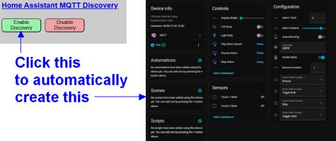
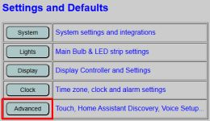
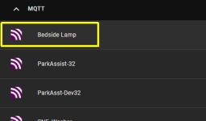
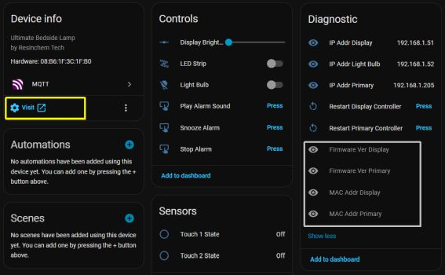
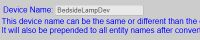
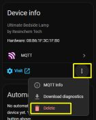

# Home Assistant Discovery
<div align="center">


</div>

If you are a Home Assistant user, you may wish to integrate your device so that you can not only control the various features from Home Assistant, but you can also use the various entities in your automations and scripts.  The system offers over 25 different entities that you can use in Home Assistant. Using Discovery, there's no configuration or manaul YAML required on the Home Assistant side.

<div align="center">


</div>

### Prerequisites
- Home Assistant v2026.3 or later (may work with earlier versions, but hasn't been tested)
- A properly configured MQTT broker
  - This can be the [Home Assistant MQTT app/add-on](https://github.com/home-assistant/addons/blob/master/mosquitto/DOCS.md)
  - You can also install an indepenent broker.  [Mosquitto](https://mosquitto.org/) is free and is the recommended choice.
- MQTT must be [enabled and configured](/mqtt.md) in this application.  You should verify that MQTT is working properly before attempting to enable Discovery.

### Enabling Discovery
From the primary controller's main web page, select the Advanced option.



MQTT Discovery is listed in a section under the Touch Control Settings


***Device Name***<br>
This name can be the same or different as the device name you used for the controller.  It is limited to 32 alphanumeric characters and spaces, but must not begin with a space.  The device name is used in a couple of different places in Home Assistant as part of the Discovery process.



The discovery process will create a new device in Home Assistant.  This device will be given the same _Device Name_ entered on the Discover page.

In addition, all entity names that are created are prepended with the device name.  The device name will be converted to lowercase and all spaces will be replaced with underscores:<br>
`light.bedside_lamp_bulb`<br>
`light.bedside_lamp_leds`<br>
`binary_sensor.bedside_lamp_touch1state`<br>
etc...

This is a function of how Discovery works and not how the firmware creates the entities.  A full list of potential entities and their names is listed at the end of this section.  You can manually edit the created entity names in Home Assistant if desired, but all are initially created with the Device Name so consider entry of this value carefully.

Once Discovery is enabled, the device name cannot be changed without first removing Discovery and then re-adding it with a new name.

***Selection of Entity Groups***<br>

You aren't required to include all entities as part of the Discovery process.  If there is an entity group that you don't want in Home Assistant, you can simply uncheck that box and no entities for that group will be included.


In the above example, Discovery would only create entities for the light bulb and LED strip.  All other unchecked entities will be omitted and no entities will be created in Home Assistant.


Compare this to the image at the top of the page that shows Home Assistant when ALL entity groups were selected.  Note that you can add or remove groups at a later time if you change your mind.  See the section on Updating Discovery below.

#### _Enable Discovery Button_
Once you have specified a device name and selected your desired entity groups, simply click the 'Enable Discovery' button.


You will be prompted to confirm your choices and once confirmed, the device and selected entities will _immediately_ be created in Home Assistant.  Note that there is **no prompt or confirmation in Home Assistant!**  The device is directly added and as soon as you see the confirmation page in the web app, the new device will be available in Home Assistant.


As shown in the confirmation dialog, you should be able to navigate to devices in Home Assistant and see the newly created device.



The Home Assistant device page may look different depending upon which entity groups were selected.  However, if you omitted some entity groups and need to access a control that isn't available in Home Assistant, you can simply click the Visit link under Device info and it will open up the primary controller's web app!

Also note that if you opt to include the Diagnostic group, the IP address of all three controllers will be shown, along with restart buttons for the primary and display controllers.  In addition, four additional diagnostic fields are included, but are initially disabled.  These include the MAC addresses and current firmware versions for the primary and display controllers.  You can enable these fields if desired in Home Assistant.

### Editing Discovery
The primary controller keeps track of the latest Discovery via a special discovery.json configuration file that is stored in the SPIFFS area of the ESP32.  A unique "discovery string" is created based on the Discovery device name you initially specified plus the MAC address of the primary controller.  Because this information is retained by the primary controller, you can edit the existing Discovery to add/remove entity groups without fear of creating duplicate entities in Home Assistant.

***Device Name***<br>
If you previously enabled Discovery and find that you wish to either add or remove entities that are included, you can easily edit and update the Discovery via the same Discovery page from the primary controller's web app.



Because the device name is used to create the unique Discovery topics, you cannot change the device name once Discovery has been run the first time.  If you need to change the device name, you first need to completely remove Discovery (see below) and recreate it.  Note that while this won't result in duplicate entities in Home Assistant, it _will_ create entities with different enntity names (since the name also includes the device name).  This might break dashboards or automations if you created those using the old names.

***Entity Groups***<br>
The entity groups will be pre-populated with the selected groups from the last Discovery operation.  Simply check any additional groups you wish to add and/or clear the checkbox from any entity groups you wish to remove.

***Update Discovery Button***<br>

Note that the buttons at the bottom of the Discovery page will have different text based on whether Discovery was previously enabled or not.


Simply click the UPDATE DISCOVERY button to immediately update the device's entities in Home Assistant.  Note that if you remove entities that were previously used on Home Assistant dashboards and/or in automations, those will now be broken as the entities were removed.

**IMPORTANT NOTE**<br>
If you perform a full reset of the primary controller (see [Controller Commands](/commands.md)) or replace the primary controller's ESP32, then any prior configuration files (including discovery.json) will be lost.  This means that if Discovery was enabled, the current system will have no way of knowing about the previous selections.

If you find yourself in this situation, you have a couple of choices depending on whether the ESP32 was replaced or not.

_System Reset - Same ESP32 & Device Name_

If you needed to perform a full system reset (which removes all configuration data) but you are using the same primary controller ESP32, you can still edit the existing discovered device in Home Assistant, **as long as you use the exact same device name** when running Discovery for the first time after a reset.  Remember that the unique "discovery topic" consists of the device name and MAC address.  As long as both of these are identical, then running Discovery will update the existing device in Home Assistant.

_Different ESP32 or Device Name_

If you replaced the ESP32 or want to use a different device name, then a new device will be created instead of updating the previous device.  If you find yourself in this situation, it is recommended that you remove the old device from Home Assistant



Simply visit the device page in Home Assistant, click the three dot menu next to the 'Visit' link and choose 'Delete'.  This will remove the device and all entities from Home Assistant and you can now run Discovery in the web app to create the new device.  Note that if you use are using a different ESP32 but use the same device name, then all entities will be recreated with the same entity names, preserving any dashboards or automations.

### Removing or Disabling Discovery

If you wish to completely remove the discovered device and all its entities from Home Assistant, use the REMOVE DISCOVERY button at the bottom of the Discovery page.


This is the recommended way to remove a device that was previously added by Discovery.  If you delete the device directly from Home Assistant (as shown in the above example), then the device may reappear the next time you start Home Assistant.  Using the REMOVE DISCOVERY button assures all discovery messages are cleaned up.  If you have a device that continues to reappear even after you have removed it, see the [Toubleshooting](/troubleshootmain.md) section.

### Entities Created

For reference, here are the list of entities that will be created in Home Assistant, based on the entity groups selected.  Note that _device_name_ represents whatever device name is specified for discovery, after converting to lowercase and replacing spaces with underscores.

|Entity Group|Entities Created | Friendly Name
|---------|--------|-----
|RGBW Light Bulb|`light.device_name_bulbstate`<br>&nbsp;&nbsp;• Brightness, color and white temperature attributes|Light Bulb<br>&nbsp;
|LED Strip|`light.device_name_ledstate`<br>&nbsp;&nbsp;• Brightness and color attributes|LED Strip<br>&nbsp;
|TFT Display|`number.device_name_dispbrightness`<br>`switch.device_name_autodim`<br>`text.device_name_clockcolor`|Display Brightness<br>Auto-Dimming<br>Clock Color
|Touch Sensors|`binary_sensor.device_name_touch1state`<br>`binary_sensor_device_name_touch2state`<br>`select.device_name_touch1func`<br>`select.device_name_touch2func`<br>`select.device_name_touch1funca`<br>`select.device_name_touch2funca`|Touch 1 State<br>Touch 2 State<br>Touch 1 Main Function<br>Touch 2 Main Function<br>Touch 1 Alarm Function<br>Touch 2 Alarm Function
|Alarms|`number.device_name_alarmvolume`<br>`number.device_name_alarmtrack`<br>`number.device_name_snoozetime`<br>`switch.device_name_gentlewake`<br>`button.device_name_alarm_snooze`<br>`button.device_name_alarm_stop`<br>`button.device_name_playalarm`|Alarm Volume<br>Alarm Track<br>Snooze Duration<br>Gentle Wake<br>Snooze Alarm<br>Stop Alarm<br>Play Alarm Sound
|Diagnostics|`sensor.device_name_ip_display`<br>`sensor.device_name_ip_bulb`<br>`sensor.device_name_ip_primary`<br>`button.device_name_rb_display`<br>`button.device_name_rb_primary`<br>`sensor.device_name_fw_display` (disabled)<br>`sensor.device_name_fw_primary` (disabled)<br>`sensor.device_name_mac_display` (disabled)<br>`sensor.device_name_mac_primary` (disabled)|IP Addr Display<br>IP Addr Light Bulb<br>IP Addr Primary<br>Restart Display Controller<br>Restart Primary Controller<br>Firmware Ver Display<br>Firmware Ver Primary<br>MAC Addr Display<br>MAC Addr Primary

💡 **NOTE**: You can rename entities and/or enable or disable any entities in Home Assistant.

### Manually Creating Entities
If you want precise control over the integrated entities, instead of using Discovery you can instead manually create the entities using YAML in Home Assistant.  Creating MQTT entities via YAML is beyond the scope of this document, but here's an example of how something like the auto dimiming entity _might_ be created:
```
mqtt:
  - switch:
      unique_id: bedlamp_autodim
      name: "Auto Dimming"
      state_topic: "stat/bedlamp/autodim"
      command_topic: "cmnd/bedlamp/autodim"
      availability:
        - topic: "stat/bedlamp/display/status"
      payload_on: "ON"
      payload_off: "OFF"
      state_on: "ON"
      state_off: "OFF"
      optimistic: false
      qos: 0
      retain: true    
```
See the official [Home Assistant MQTT documentation](https://www.home-assistant.io/integrations/mqtt/) for more information on manually creating MQTT entities.  This method is only recommended for **advanced** Home Assistant users.