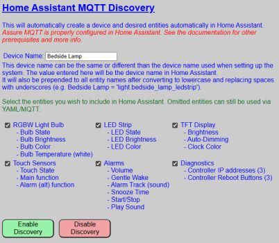
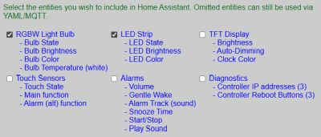
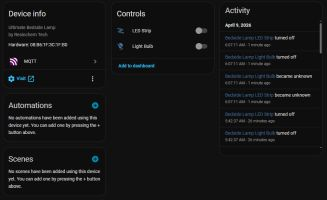

# Enabling and Disabling Discovery
{: .no_toc }

---

  

Once your MQTT broker is verified and your Device Name is chosen, you are ready to initiate the Discovery process. This establishes the initial link between your lamp and Home Assistant.

---

## Accessing the Discovery Menu
The Discovery settings are located within the **Advanced** menu of the primary controller.

1. From the main web application, click the **Advanced** button.
2. Scroll down to the section located under the **Touch Control Settings**.

## Enabling Discovery
Before clicking the enable button, confirm your configuration:

* **Device Name:** Ensure the name is 1-32 characters and correctly formatted (alphanumeric and spaces only).
   * Recall that the device name will be assigned to the created device in Home Assistant _and_ will be prepended to all entity names.  This is a Home Assistant _"feature"_ and a not function of the firmware.
* **Entity Groups:** Check the boxes for the groups you wish to export to Home Assistant. You can always add more later.
> **💡 Entity Group Selection** It is not required that all entity groups be selected.  You can choose which entity groups you want included in the Home Assistant device.
{: .note }

If the above selections are made, then in Home Assistant just the entities related to the light bulb and LED strip will be generated.

### The Enablement Process
Click the **ENABLE DISCOVERY** button. You will be prompted with a final confirmation dialog. 

> **💡 Instant Integration** There is no prompt or "accept" button within Home Assistant itself. As soon as you confirm in the lamp's web app, the device is broadcast to the broker and Home Assistant will immediately add the new device and entities.
{: .note }

Once confirmed, you can navigate to the **Devices & Services** section in Home Assistant to verify the "Bedside Lamp" (or your custom name) is listed.

---

## Removing or Disabling Discovery
If you need to completely remove the lamp from your Home Assistant environment, do not simply delete it from the HA dashboard.

> **⚠️ Proper Removal Procedure** If you simply delete the device directly within Home Assistant, it may spontaneously reappear the next time the lamp or the HA server restarts. To permanently remove the integration, use the **REMOVE DISCOVERY** button on the lamp’s Discovery page.
{: .warning }

Clicking **REMOVE DISCOVERY** sends a "clearance" message to the MQTT broker, ensuring all discovery topics are purged and the device is cleanly unlinked from Home Assistant.  If you end up with orphaned entities or ones that continue to reappear in Home Assistant, see the [Troublshooting](/troubleshooting.md) topics.

  <a href="{{ '/discoverymain' | relative_url }}" class="btn btn-outline"><- Previous: Home Assistant Discovery</a>
  <a href="{{ '/discoveryentities' | relative_url }}" class="btn btn-purple">Next: Editing or Hiding Entities -></a>

