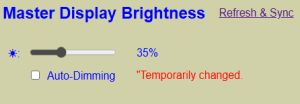
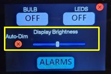

# Managing the Display Brightness
{: .no_toc }

---

  

This section covers the various methods for controlling the display’s brightness level. 

> **💡 Reminder: Active vs. Default** Unless otherwise noted, these processes only update the **ACTIVE** settings. Changes will be lost and the display will revert to its **DEFAULT** brightness if the system is restarted or reboots. Review the [Web Application Overview]({{ '/webapp' | relative_url }}) for more on this concept.
{: .note }

## Key Brightness Behaviors

### Auto-Dimming Overrides
If [Auto-Dimming]({{ '/autodim' | relative_url }}) is enabled, any manual brightness adjustment will be overridden within seconds by the automated light sensor logic. To maintain a manual brightness level, you must first disable the **ACTIVE** auto-dim setting.

### "Wake on Tap" (Temporary Brightness)
If the current brightness is lower than your system's default, you can tap anywhere on the display to temporarily increase the brightness to the default level. After approximately 10 seconds of inactivity, the screen will automatically return to its dimmed state.

### Automatic Brightening
The screen will automatically brighten temporarily during the following events:
* **Alarms:** The screen brightens when an alarm sounds and reverts once snoozed or stopped.
* **Settings:** The screen brightens when entering any on-device settings menus to ensure visibility.

---

## Control via the Web Application
Active brightness controls are managed from the main **Display** page of the web app.

### Manual Adjustment

1. **Disable Auto-Dim:** If enabled, uncheck the Auto-Dimming box. A temporary message will appear reminding you that this change is only active until the next reboot.
2. **Brightness Slider:** Move the slider to immediately update the display. Setting this to 0% effectively turns the display off (though it still responds to "Wake on Tap").

>**💡 Manual Override: Use with Caution** The manual slider allows you to force the display to a specific brightness, bypassing the auto-dimming logic. This is great for showing off the screen to friends, but be careful! Sliding this to 100% in a pitch-black room is a very efficient way to accidentally give yourself a temporary retinal tan. Your sleepy 3:00 AM self will thank you for letting the auto-dimming handle the heavy lifting.
{: .note } 

### Refresh & Sync
The web page does not automatically detect brightness changes made via the touch panel or external APIs. Click the **REFRESH & SYNC** link to update the web interface with the hardware's current active values.

---

## Control via the Touch Display
If touch is enabled, you can adjust brightness directly on the device:

1. Tap the **Gear Icon** (⚙) in the upper right corner of the clock.
2. Toggle the **Auto-Dim** state by tapping the **X** or **✔** icons.
3. Once disabled, use the slider to adjust the brightness.

*The interface will return to the clock after 10 seconds of inactivity, or you can tap the red **X** in the upper right corner.*

---

## Control from External Sources
The display can be integrated into external smart home systems like Home Assistant.

### MQTT
Commands are sent to the `cmnd/` topic. Examples:
* **Set Auto-Dim State:** `cmnd/[topic]/autodim` (Payload: `on`, `off`, `1`, or `0`)
* **Set Brightness:** `cmnd/[topic]/dispbrightness` (Payload: `0-255`, where 255 is 100%)

### HTTP API
Post URLs directly to the controller’s IP address:
* **Set Auto-Dim:** `http://[IP]/api?autodim=0` (0 for off, 1 for on)
* **Set Brightness:** `http://[IP]/api?dispbrightness=96` (Value 0–255)
* **Relative Adjustment:** `http://[IP]/api?dispbrightness=up` (Increases/decreases by ~10%)

See the [API HTTP Command List]({{ '/api' | relative_url }}) for the full range of commands.

---

  <a href="{{ '/lightcontrol' | relative_url }}" class="btn btn-outline"><- Previous: Controlling Lights</a>
  <a href="{{ '/commands' | relative_url }}" class="btn btn-purple">Next: Controller Commands -></a>

