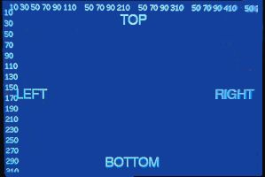
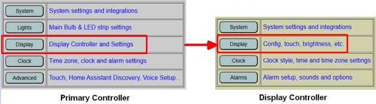
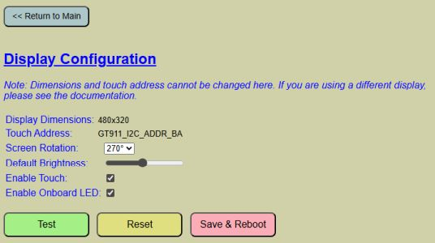
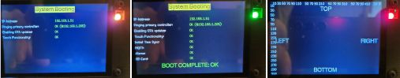
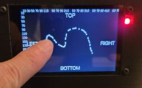
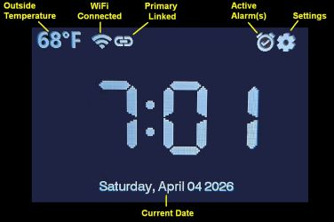

# Display Settings and Options
{: .no_toc }

---

  

The main display is a 3.5" 'Cheap Yellow Display' (CYD) featuring capacitive touch and a resolution of 480x320 pixels. 

> **⚠️ Hardware Compatibility** As detailed in the [Build Article](https://resinchemtech.blogspot.com/2026/05/ultimate-bedside-lamp.html), using a different display model will likely require firmware modifications, specifically within the **TFT_eSPI** library configuration. 
{: .important }

---

### Configuring the Display
To access the display settings, navigate to the **Display** section of the primary web application. Note that the interface will switch to the Display Controller, indicated by a pale yellow background.

The configuration page is divided into two sections. The top section manages the hardware behavior and orientation of the display itself.

#### Hardware Definitions
* **Dimensions & Touch Address:** These values are hard-coded in the TFT_eSPI library during firmware compilation and cannot be changed via the web app. If you are using non-standard hardware, refer to [Modifying the Firmware]({{ '/firmwaremods' | relative_url }}).
* **Screen Rotation:** Options include 0°, 90°, 180°, and 270° (Default). 
    * **Note:** The firmware is optimized for landscape (90°/270°). Portrait orientations may result in text being cut off. 

#### Operational Settings
* **Default Brightness:** Sets the initial brightness level after a reboot. If [Auto-Dimming]({{ '/autodim' | relative_url }}) is enabled, this value is overridden by ambient light levels, though it is still used as the "base" brightness when the screen is tapped.
* **Enable Touch:** This controls the capacitive touch features of the display. 
    > **⚠️ Warning** If you disable this feature, you will lose the ability to access settings or menus directly via the display. Only uncheck this if your hardware does not support capacitive touch.
    {: .warning }
* **Enable Onboard LED:** If your display hardware includes a front-facing RGB LED, this option allows it to show system status.
    * **Yellow:** Booting/Process in progress.
    * **Green:** Successful connection/boot.
    * **Red:** Failure or Test Mode.
  

  

### Testing and Maintenance
The system provides built-in tools to verify your display and touch configuration without requiring a reboot.

* **TEST Button:** Activating this shows the visual boundaries of the screen, scale indicators, and lights the onboard LED red. 
* **Touch Testing:** If touch is enabled, you can drag your finger to draw lines, confirming the calibration and responsiveness of the screen.

* **RESET Button:** Reverts all unsaved changes on the page to the previously saved defaults.
* **SAVE AND REBOOT:** Commits current settings to the flash memory and restarts the controller to apply them. **Unsaved changes are lost if you navigate away from this page.**

---

### The Standard Clock Display
When idle, the display shows the clock and environmental data. Several status icons are positioned along the top edge:

  

* **Outside Temperature:** Displays the local outdoor temperature. This requires a configured source such as Open Weather Map, MQTT, or the HTTP API. Refer to [Temperature and Weather]({{ '/weather' | relative_url }}) for setup.
* **WiFi:** Indicates connection status. A slash indicates the display controller is offline .
* **Primary Link:** Indicates a successful API connection to the Primary Controller. Shown with slash if not connected
* **Active Alarms:** Only appears when one or more alarms are scheduled and active.
* **Settings:** Tapping this icon enters the local settings menu for lighting and alarm control. Details can be found in [Using the System]({{ '/usingmain' | relative_url }}).
* **Time:** The core clock display. Font, color, and 12/24-hour formats can be modified under [Clock and Time Options]({{ '/time' | relative_url }}).
* **Date:** The current date is shown on the bottom of the display.  This is also set as part of the time.

---

  <a href="{{ '/webapp' | relative_url }}" class="btn btn-outline"><- Previous: Web App Overview</a>
  <a href="{{ '/autodim' | relative_url }}" class="btn btn-purple">Next: Auto-Dimming -></a>

