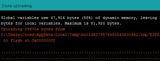

# Firmware Updates and Modifications
{: .no_toc }

---

  

Future versions of the firmware—containing bug fixes, performance improvements, or new features—may be released periodically. Additionally, because this system was built with specific hardware and design needs in mind, you may wish to modify the code to better suit your own unique use cases.

These sections cover the methods for installing official firmware releases and provide technical tips if you choose to modify the source code yourself. Think of this as the "brain surgery" section of the documentation. Whether you’re keeping up with the latest fixes or hacking the code to make the lamp do things I never intended, this is where the evolution happens. 🧠

---

### In This Section

* **[Installing Official Firmware Updates]({{ '/firmwareupdates' | relative_url }})** – Detailed steps for updating the Primary and Display controllers wirelessly or via USB.
* **[Modifying the Firmware]({{ '/modifications' | relative_url }})** – Tips, tools, and structural information for those interested in customizing the C++, HTML, or CSS.

---

> **❗ Support Disclaimer** While I am happy to answer questions regarding the official firmware releases, I am unable to provide technical support for modified versions of the code. I simply do not have the bandwidth to maintain or troubleshoot unique forks of the project.
{: .important }

### Required Technical Knowledge
If you intend to modify the firmware, you should have a solid understanding of:
* **Arduino / C++:** For core logic and hardware register management.
* **HTML & CSS:** For the web interface layout and styling.
* **JavaScript:** For the interactive elements of the web application.

The source code is fairly well-documented to assist you in navigating the logic. Additional information can be found in the [Modifying the Firmware]({{ '/modifications' | relative_url }}) section.

---

  <a href="{{ '/discoverymanual' | relative_url }}" class="btn btn-outline"><- Previous: Manually Creating MQTT Entities</a>
  <a href="{{ '/firmwareupdates' | relative_url }}" class="btn btn-purple">Next: Installing Updates -></a>

