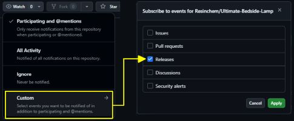
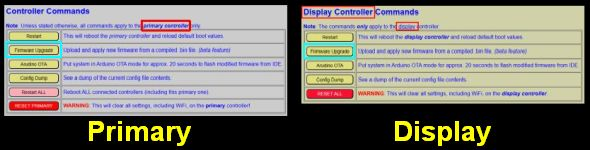
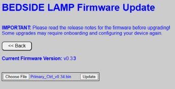
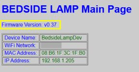

# Installing Firmware Updates
{: .no_toc }

---

  

From time to time, new versions of the firmware are released to provide bug fixes, new features, or support for updated hardware. This section covers how to obtain the latest files and apply them safely to your system.

---

### Update Notifications
Since the system is designed for local privacy and operates without a constant internet "phone home" connection, there is no automatic push notification for updates within the web app.

To stay informed, it is recommended to "Watch" the official repository:
1. Log into your GitHub account.
2. Navigate to the [Ultimate Bedside Lamp repository](https://github.com/Resinchem/Ultimate-Bedside-Lamp).
3. Set a **Watch** notification for "Releases."

---

### Obtaining the Latest Firmware
The most recent stable files are always located in the **Releases** section of the GitHub repository.

  

#### Release Notes
Each release includes notes detailing exactly what changed. Some updates may target only one controller, while others update the entire system. All releases will contain both controller's firmware, but the release notes will indicate which files have been updated and which remain the same. 

> **❗ Pay Attention to Breaking Changes** Always check the release notes for a **BREAKING CHANGES** section. These may require you to perform extra configuration steps or hardware adjustments during the upgrade process.
{: .important }

  

#### Which file do I need?
If you are running the standard, unmodified firmware, you only need the `.bin` files:
* **Primary Controller:** `Primary_Ctrl_vX.XX.bin`
* **Display Controller:** `Display_Ctrl_vX.XX.bin`

*(X.XX represents the version number)*

---

### Installing the Update
> **⚠️ WARNING: Files are NOT Interchangeable** The Primary and Display controllers use different pin mappings and logic. Attempting to flash the Primary firmware onto the Display controller (or vice-versa) will render the system inoperable. You will likely need to reflash via a USB cable to recover.
{: .warning }

1. Navigate to the **Controller Commands** section of the unit you wish to upgrade.
2. Click the **Firmware Upgrade** button.

3. On the upgrade page, verify the **Background Color** (Gray for Primary, Yellow for Display) to ensure you are on the correct unit.  You can also check the labels and current version number as extra confirmation.
4. Click **Choose File** and select the `.bin` file you downloaded.
5. Click **UPDATE**.

A progress bar will appear. Once the upload reaches 100%, the controller will automatically reboot.

---

### Verifying the Update
Once the system reboots, navigate to the top of the controller's main page. The version string in the header should now reflect the updated version number.

If the old version number is still displayed, the update failed and the system successfully "rolled back" to the previous firmware. You can attempt the flash again or consult the [Troubleshooting]({{ '/troubleshootmain' | relative_url }}) guide.

---

### Using Third-Party Utilities
While the internal web update is the recommended path, utilities like [ESPConnect](https://thelastoutpostworkshop.github.io/ESPConnect/) can be used as a fallback.

> **⚠️ Critical: Partition Layouts** Due to the complexity of the firmware, this project uses non-standard partition sizes. 
> * **DO NOT** select "Erase Flash" before flashing; this will wipe your configuration files and Wi-Fi credentials.
> * Your utility **must** support custom partition offsets. Failure to respect the partition layout will result in a boot failure.  See [Advanced](/advanced.md) topics for information on required partitions.
{: .warning }

---

### Updating Modified Firmware
If you have customized the C++, HTML, or CSS, applying an official `.bin` update **will overwrite all your changes.** You must instead pull the updated source code from GitHub and re-apply your modifications manually before compiling.

---

  <a href="{{ '/firmwaremain' | relative_url }}" class="btn btn-outline"><- Previous: Firmware Updates</a>
  <a href="{{ '/modifications' | relative_url }}" class="btn btn-purple">Next: Modifying the Firmware -></a>

