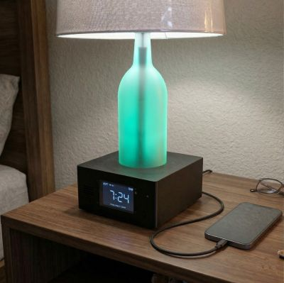

# Ultimate Bedside Lamp and Clock
{: .no_toc }

---

  

---

This site contains information regarding the installation, configuration and use of the firmware for this project.  

> **⚠️ Build Instruction Notice**  This documentation **does not** contain build instructions, parts lists, or wiring diagrams. For the physical build details, please refer to the following resources:
> * **YouTube Overview: [{{site.substitutions.youtube_title}}]({{site.links.youtube_video}})**
> * **Written guide (parts list, wiring diagrams, etc.): [Building the Ultimate Bedside Lamp](https://resinchemtech.blogspot.com/2026/05/ultimate-bedside-lamp.html)**
{: .important }

> **🤖 AI Transparency Statement** The provided firmware and documentation were created and developed by me (**a certified human**).  While Gemini AI was used to resolve issues with some of the more complex logic, _no code was blindly copied and pasted without detailed review_.  Gemini was also used to style and to provide consistency across these documentation pages.  But all content is mine... and developed by a real human!
{: .note }

### How this document is organized
The documentation follows a logical setup flow, grouped into the sections seen in the sidebar:
1.  **Welcome:** About the project, concepts and terminology.  
2.  **Getting Started:** Initial firmware flashing, onboarding and interface setup.
3.  **Setting Up the System:** Web app overview and setting various system options.
4.  **Alarms:** Various methods for setting and responding to alarms, including selecting an alarm sound.
5.  **General System Use:** General operation of the system

The remaining topics cover optional and more advanced options, along with a troubleshooting section.

**If you are setting up your system for the first time, begin with the [Getting Started](/startingmain) section.**

### Hardware Substitutions

The firmware is written for a very specific set of hardware. If you decide to swap the display for a different model you found in a "miscellaneous electronics" drawer, congratulations! You’ve just been promoted to Lead Engineer of your own custom fork.

>🛠️ **Please Note** While I admire the DIY spirit, I simply don’t have the bandwidth to maintain multiple versions of the firmware. If you venture off-book, you are the Captain of that ship—I’ll be on the shore cheering you on, but I can't help you navigate the "Why is my screen mirrored and purple?" phase of the journey.
{: .important }

*If you use different hardware, you will need to fork this repository and modify the code yourself. See the [**Modifying the Firmware**](/modifications.md) section for more info.*

### Opening Issues
* **Issues:** Reserved strictly for firmware errors or bugs.
* **Discussions:** For enhancement requests, "how-to" questions or problems that aren't firmware releated.

**Issues opened for feature requests or alternate hardware will be closed without response.**
{: .label .label-yellow }

   <a href="{{ '/about' | relative_url }}" class="btn btn-purple">Next: About the Project -></a>

