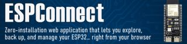
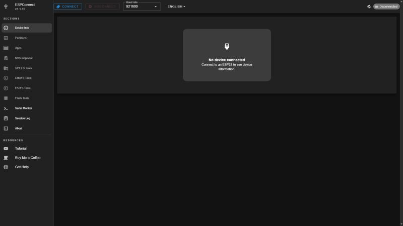
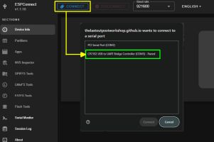
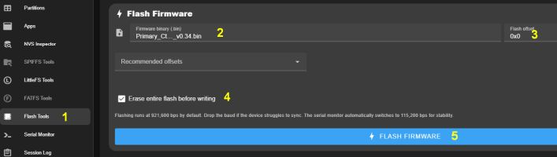
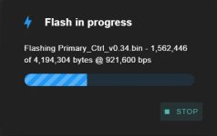
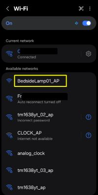

# Initial Firmware Installation
{: .no_toc }

---

  

The first preparation step you need to complete is the installation of the firmware onto the controllers. This process is called **flashing**. Historically, this was one of the steps that caused the most frustration due to the need for specific desktop utilities and complex settings.

To make this process as simple as possible, we now use a modern, browser-based tool called **ESPConnect**.

ESPConnect is a free, open-source web tool for interacting with ESP32-based microcontrollers. It allows you to flash firmware directly from your browser using the same technology found in tools for WLED, Tasmota, and ESPHome.

---

## Prerequisites

To complete the installation, you will need:
* **Hardware:** A computer with an available USB port and a **microUSB Data Cable**. (Note: "Power-only" cables will not work).
* **Firmware:** A copy of the firmware `.bin` files (available in the [Releases](https://github.com/Resinchem/Ultimate-Bedside-Lamp/releases) area of the repository).
* **Software:** A Chromium-based browser (Chrome, Edge, Brave, or Arc) version 89 or newer.

> ### 🖥️ Browser Alternatives
> If you do not wish to use a Chromium-based browser, you must use traditional desktop flashing utilities. For guidance on that method, you can refer to my [Beginner's Guide to Flashing Custom Firmware](https://youtu.be/74NGHj-cOls) video (skip to the **8:08** mark).
{: .note }

---

## Kauf RGBW Wi-Fi Bulb

**No installation is necessary for the bulb!** The device comes pre-installed with the required firmware. 

**Do not attempt to flash any other firmware to the bulb.** Replacing the official Kauf ESPHome firmware will cause the device to fail within this project. If you wish to make minor changes (such as the device name), use the official ESPHome code provided by the manufacturer.
{: .label .label-yellow }

---

## Primary and Display Controllers

The process for both controllers is identical. The only difference is the firmware `.bin` file used:

* **Primary Controller:** Use `Primary_Ctrl_vx.xx.bin`
* **Display Controller:** Use `Display_Ctrl_vx.xx.bin`

*(Note: `vx.xx` represents the version number. Always use the most recent versions found in the assets section of the latest release.)*

### Step 1: Connect to ESPConnect
Open a Chromium-based browser and navigate to the [ESPConnect Tool](https://thelastoutpostworkshop.github.io/ESPConnect/).

  

If you haven't done so yet, connect the controller (the ESP32 for primary, or the Cheap Yellow Display for display) and click the **Connect** button in the upper-left corner.

Select the appropriate **COM Port**. 

> ### 🔍 Troubleshooting COM Ports
> If you aren't sure which port to pick, disconnect the ESP32 and check the list; the port that disappears is your device. If no ports appear, you may need to install the **CP2102** or **CH340** USB-to-Serial drivers for your specific hardware.
{: .note }

### Step 2: Configure Flash Settings
Once connected, select **Flash Tools** from the left sidebar menu.

1. **Select Flash Tools**: Select the Flash Tools option from the sidebar menu.
2. **Select Firmware:** Click the Firmware Binary box and select the proper `.bin` file for the controller you are flashing.
3. **Flash Offset:** Leave this at the default **0x0**.
4. **Erase Flash:** Check the **Erase entire flash** checkbox to ensure a clean installation.
5. **Install:** Click the large blue "Flash Firmware" button to start the upload process.

### Step 3: Flash and Verify
ESPConnect will show a progress bar during the flashing process:

Once the flashing is complete, power cycle the ESP32 by unplugging and reconnecting it to the USB port. Wait a few moments, then use your phone or computer to scan for available Wi-Fi networks:

**Success Criteria:** If you see a Wi-Fi hotspot named `BedsideLamp01_AP` (or `BL_Display01_AP` for the display), the flash was successful.

---

### Next Steps
Repeat the above steps for the second controller. Once both are flashed and broadcasting their respective hotspots, you are ready to join them to your Wi-Fi network. This is covered in the next section, [Onboarding and First Time Setup]({{ '/onboarding' | relative_url }}).

| [<- Previous: Getting Started]({{ '/startingmain' | relative_url }}){: .btn .btn-outline } | [Next: Onboarding ->]({{ '/onboarding' | relative_url }}){: .btn .btn-purple } |