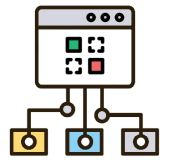
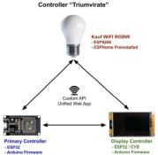
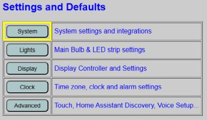
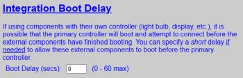
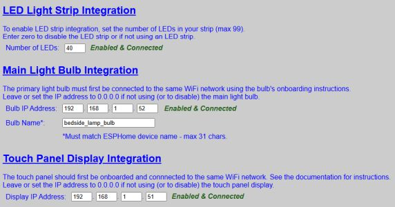
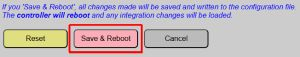
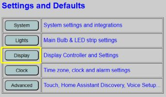
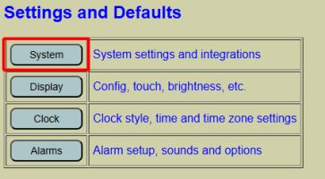
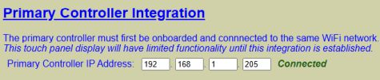

# Setting up the System Interfaces
<div align="center">


</div>

As covered under [Overall Concepts and Terminology](/concepts.md), the system uses three ESP-based controllers in a "triumvirate" configuration.



The controllers are not physically wired together.  Instead they communicate wirelessly using an internal API.  But for this to work, each controller needs to know the IP address of the other controllers (plus the bulb name for the RGBW bulb).  Information on gathering this information is covered under the [Onboarding and First Time Setup](/onboarding.md) section.

To specify the interfaces between controllers, we are going to need to access the web application.  Full details and use of the web app is covered in other sections, so this section is going to focus primarily on the necessary settings to get the system up and running.

### Accessing the Web Application

First assure you've completed the onboarding for all three controllers (bulb, primary and display). Power on all three controllers and then open a web browser on a device on the same WIFI network as the controllers.

Enter in the IP Address of the **PRIMARY** controller.  For example, if my primary controller has an IP address of 192.168.1.205, then in a browser's address bar, I would just enter: ```http://192.168.1.205```



You will see controls for various items, such as the lights on this page.  But they likely won't work, or work as expected, until you complete the system integrations.  Look for the System button under Settings and Defaults and click it. 

### System Settings and Integrations

**NOTE:** When opened, the system integration page actually verifies each interface by issuing a test command and waiting for a response.  Across all the various interfaces, this can take a few seconds.  When the System Settings page is first opened, all integrations will show as Loading... and all fields will be disabled while these integrations are tested and verified.


Be patient and don't attempt to reload the page (this will just restart the testing).  Instead, wait for loading messages to be replaced with the actual tested results (e.g. Enabled & Connected, Not Connected, Disabled, etc.) and for all fields to be enabled before proceeding.

#### Boot Delay
At the top of the page is a setting that technically isn't an integration but impacts how and when integrations get loaded and the controlers establish communications.



When the system is powered on (or all controllers are simultaneously rebooted), they attempt to establish communication with each other.  Normally this works without issue and the code for each controller waits until it receives confirmation that the other controllers are available.  However, in some situations (usually related to weak WiFi) a particular controller may take longer than expected.  If this is the case, you can add a short delay to the primary controller's boot up process.  You should only use this feature if your system is having issues when all three controller start at the same time.

Leave this value at 0 seconds unless you are experiencing boot-up communication issues.  See the [Troubleshooting](/troubleshooting.md) sections for more information if you are experience boot-up issues.

The other initial setup integrations are listed below.



There are numerous integration settings on this page which are covered in other sections, but for the initial setup, you need to complete three sections.

#### LED Light Strip Integration

Simply enter the total number of LEDs used in your LED strip.  If the number entered is too low, not all the LEDs will light up.  If the number is too large, all the LEDs will be lit up, but will be slightly dimmer since the power calculation uses the total number of LEDs.

If you have already assembled your project and don't know the number of LEDs, just estimate for now and you can fine tune later.  If bench testing with a yet-uncut LED strip, just enter in something like 15 or 20.

#### Main Light Bulb Integration

For this section, you need to enter in the RGBW bulb's IP address _and_ the bulb's name.  How to get (and even rename) the bulb is covered under the Onboarding section.  If you are going to change the bulb name, do it **prior** to setting up this configuration and assure you've power cycled the bulb at least once.

Remember that the bulb name must be entered in "Home Assitant Entity" format, meaning all lowercase and substituing underscores for any spaces.

#### Touch Panel Display Integration

Just enter in the IP address of the display controller.  Again, as covered in the Onboarding section, static or reserved IP addresses are recommended for all three controllers.  If you are going to assign a static/reserved IP to your devices, this should be done **before** completing this section and each controller should be power cycled.

#### Save and Reboot

Do not attempt to configure any other interfaces on this page right now.  Once all controllers are communicating, you can return to this page and set up other options like MQTT and a weather integration.  Once you've completed and confirmed the information in the above three sections, scroll to the bottom of the page and click "Save and Reboot":



The controller will reboot.  You may see "boot indicators" (such as the LED strip flashing red, green and blue, followed by the same from the bulb).  The boot process and default indicators ar described in the [The Boot Process](/booting.md) section.

**NOTE**: Because the primary and display controller share many configuration values, changing anything that requires a change to the saved configuration file and a reboot of the primary controller may also require a reboot of the display controller.  The system generally handles this, but you can use the [Controller Commands](/commands.md) for an individual controller and force a reload of current configuration files if needed.  Just don't be surprised that when the primary controller reboots, it is followed by an automatic reboot of the display controller.

This completes the primary controller setup so it knows how to find the bulb and the display controller.  But after the initial reboot, we have one more interface to set up for the display controller so it can find the primary controller.

#### Launch the Web App Again

After the primary controller reboots, once again go to the primary controller's IP address in a browser.  However, this time select "Display" from the options under Settings and Defaults.



This actually transfers you to the display controller's interface.  When normally using the system, you don't have to worry about which controller you are using (with a few minor exceptions) and the web application will handle switching between controller interfaces.  But you can tell which controller you are working with by the background color (in addition to the browser's tab title and the top device name).  The primary controller's interface will have a light gray background, while the display controller's interface has a pale yellow background.

#### Display Controller Configuration

From the display controller's interface, locate the "System" option under Settings and Default (note the pale yellow background that lets you know you are working directly with the display controller).



There is only one setting we need to complete on this page that is needed for the initial configuration.



Simply enter in the IP adress of the **primary** controller.  

#### Save and Reboot
Again scroll to the bottom of the page and click "Save and Reboot".  The display controller will reboot and attempt to connect to the primary controller.  You can watch the display to see if this succeeds.

Once all three controllers are "talking" to one another, the initial system configuration is now complete.  You can return to the web application and begin to configure other interfaces and setup your preferences.  This is covered in the following sections.


