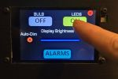
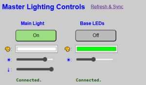
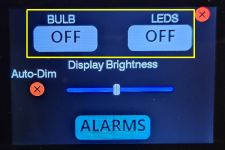

# Controlling the Lights
{: .no_toc }

---

  

This section covers the various methods for controlling the main RGBW light bulb and the LED strip. 

> **💡 Reminder: Active Settings** Most interactions described here only update the **ACTIVE** settings. This means any changes to colors or brightness will be lost and the hardware will revert to its **DEFAULT** boot settings if the system is restarted or power is lost.
{: .note }

---

### Control via the Web Application
The web application offers the most granular control over your lighting. The controls are located at the top of the primary controller’s main page.

#### Color Selection
Clicking the color box for either light opens the color picker. 

* **Visual Selection:** Use the slider for the hue and the large box for saturation/value.
* **Eyedropper:** Select any color visible on your desktop.
* **Manual Input:** Enter RGB, HSL, or Hex codes. Note that selecting a color automatically switches the light bulb to **RGB Mode**.

#### Core Controls
* **State Buttons:** Toggle the power for either the bulb or the strip. 
* **Brightness Sliders:** Represented by the "sun" icon. Move to the right to increase intensity. The value is sent to the hardware as soon as you release the slider.
* **White Temperature (Bulb Only):** Indicated by the thermometer icon. Sliding to the left creates a "Cool" blue-white; sliding to the right creates a "Warm" yellow-white.
    * **Auto-Mode Switch:** Adjusting this automatically switches the bulb to "White Mode." The color picker box will turn white to reflect this state.

> **⚠️ Performance Note** The ESP32 processes web requests alongside all other system functions. You may notice a slight delay (1–2 seconds) between clicking a button and seeing the interface update. Avoid rapid "multi-clicking" to prevent queuing up conflicting commands.
{: .warning }

#### Refresh & Sync
The web server only sends data in response to a request. If you change the lights via MQTT or the touch display while the web app is open, the browser won't know. Click the **REFRESH & SYNC** link to force the web app to pull the current "Active" values from the hardware.

---

### Control via the Touch Display
If touch is enabled, you can toggle the power states directly from the clock.

1. Tap the **Gear Icon** (⚙) in the upper right corner of the clock display.
2. Tap the **Bulb** or **LED** button to toggle the state.

> **💡 Note: State Only** The touch display only toggles the On/Off state. The lights will turn on using whatever **ACTIVE** color, brightness, and temperature are currently in effect. To change colors or brightness, use the web app or external commands.
{: .note }

*The settings menu will automatically exit and return to the clock after 10 seconds of inactivity, or you can tap the red **X**.*

---

### Control from External Sources
Advanced users can integrate the lamp into systems like Home Assistant via MQTT or the HTTP API.

#### MQTT
Commands are sent to the `cmnd/` topic. Examples include:
* **Set LED State:** `cmnd/[topic]/ledstate` (Payload: `on`, `off`, `0`, or `1`)
* **Set LED Brightness:** `cmnd/[topic]/ledbrightness` (Payload: `0-255`)
* **Set LED Color:** `cmnd/[topic]/ledcolor` (Payload: `255,0,0` or `#ff0000`)

See [MQTT Setup and Topics]({{ '/mqtt' | relative_url }}) for the full list of available topics.

#### HTTP API
The API is accessible via standard URL posts to the controller’s IP address:
* **Set Bulb State:** `http://[IP]/api?bulbstate=on`
* **Set Bulb Brightness:** `http://[IP]/api?bulbbrightness=96`
* **Set Bulb Color:** `http://[IP]/api?bulbcolor=ff0000`
* **Set Bulb Temp:** `http://[IP]/api?bulbtemp=225`

See the [API HTTP Command List]({{ '/api' | relative_url }}) for details.

  <a href="{{ '/usingmain' | relative_url }}" class="btn btn-outline"><- Previous: General System Use</a>
  <a href="{{ '/dispbrightness' | relative_url }}" class="btn btn-purple">Next: Managing Display Brightness -></a>

