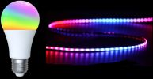
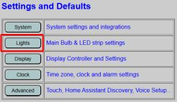
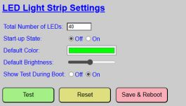
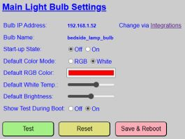

# Light Bulb and LED Strip Settings

To access the default settings and configuration of the RGBW Light Bulb and LED Strip, select the "Lights" option for the primary controller's main menu.

The page is divided into two sections, with the bulb configuration and settings at the top and those for the bulb at the bottom.  Note that these are **DEFAULT** boot settings for the lights and don't impact any **ACTIVE** settings.  See [Web Application Overview](/webapp.md) for more information on **DEFAULT** vs. **ACTIVE** settings.

### LED Strip Configuration and Settings

#### _Total Number of LEDs_
This is the same setting/value as found on the Integrations page.  However, you may not have initially known the actual number of LEDs in your build (especially if you are using a COB strip) and might have just put in an initial guess.  But you can use this page to test and fine-tune the exact number of LEDs.  To do so, enter in an guess and use the Test button to light up the LED strip. See if it appears that the entire strip is lit.  Then 'Stop' the test and adjust the number of LEds and test again.  Repeat until you notice the topmost LED pixel turns off.  Then add one more back to this value to set the total number of LEDs.

#### _Start-up State_
This indicates whether the LED strip will be turned on or off when the system boots and starts up.  When set to 'on' the LED strip will turn on using the specified default color and brightness.

#### _Default Color_
This will be the **DEFAULT** starting color of the LED strip, whether the start-up state is off or on.  This means that even if the start-up state is off, when manually turned on, they will start with this color until the **ACTIVE** value is modified.  When you click on the color box, a color picker is displayed:

You can use the slider and large box at the top to pick a color.  Or you can use the eyedropper to choose a color from anywhere on your desktop.  Or you can manually enter in the individual RGB values.  Alternatively, you can click the little arrows next to the RGB boxes to toggle the manual input values to HSL or even Hex.

Click the "TEST" button to try out any colors.  Click "STOP" to end the test and return to editing.

#### _Default Brightness_
The sets the **DEFAULT** or boot-up starting brightness value for the LEDs.  Again, this is just the starting value and will be applied whenever the LEDs are turned on until the **ACTIVE** brightness value is changed.

**NOTE**: Some LED strips may not illuminate at the lowest brightness settings.  If you find that the LEDs appear to remain off even when toggled on, check the brightness level.  You may need to slightly increase the brightness level to actually see any output from the LED strip.  Use the TEST button if necessary.

#### _Show Test During Boot_
By default, the LEDs are tested during the primary controller's boot up process.  If enabled, the LED strip will briefly flash red, green and blue before assuming the default start-up state, color and brightness.  It is recommended that you leave this setting on during initial startup and testing, but you can toggle it off if you do not wish to see the LED strip testing during the boot process.  See the [Boot Process](/booting.md) section for more information on the boot process and the visual indicators available.

#### _Test Button_
As mentioned above, you can use the TEST button to test the current number of LEDs, default color and default brightness settings.  Clicking 'Test' will toggle on the LED strip with the currently entered values.  Click 'Stop' to end the test and return to editing mode.

#### _Reset Button_
If you've made changes, but want to set the default values back to the last saved configuration (the one used at the last boot), simply click 'Reset' and the values will revert back to the saved values.

#### _Save and Reboot Button_
Once you have established your preferred default boot values, click the "SAVE and REBOOT" button.  This will write your current settings to the saved configuration file.  The controller will then reboot and load your new values as the boot defaults.  Note that this ONLY applies to the LED strip settings, as the light bulb has its own set of buttons, as covered next.

### Main Light Bulb Settings

The light bulb settings appear under the LED strip settings on the light configuration page.  It works almost identically to the LED strip options, with a few additions.

#### _Bulb IP Address & Bulb Name_
These fields are informational only.  If you need to change the IP address or device name for the RGBW Light Bulb, see the [System Settings & Integrations](/interfaces.md) section.  

#### _Start-up State_
Similar to the LED strip, you can specify whether you want the bulb to set to "off" or "on" at the completion of the boot process.  If set to 'on', it will use the specified default color mode, brightness and either the default RGB color or default white temperature (depending on color mode selected).

#### _Default Color Mode_
When using a smart bulb, if it has a dedicted white channel (usually indicated by the presence of a "W" in the description, such as RGBW, RGBWW or RGBCW), it means that in addition to an RGB color, you can also set a white temperature... from cool white to warm white.  The color mode indicates whether the bulb's color is determined by the RGB color value or the white temperature value.  Use this to specify the starting **DEFAULT** color mode for the bulb.

#### _Default RGB Color_
This is identical to setting the default RGB color for the LED strip.  When clicked, you get the same color picker and options as shown for the LED strip above.

#### _Default White Temperature_
To specify the default starting white temperature when the bulb mode is switched to white or temperature mode, simply move the slider.  Moving the slider to the left, sets the white temperature to 'cool' white, or a more bluish-white (min cool temperature for the Kauf bulb is approximately 150 mired/6,600 K) to a 'warm' white or a more yellowish-white (max warm temperature is approximately 350 mired/2,800 K)

#### _Default Brightness_
This is identical to the LED strip.  Set a default brightness for the light bulb.  This will be the starting brightness for the bulb whenever it is turned on unless the **ACTIVE** brightness has been changed.

#### _Show Test During Boot_
This is also identical to the LED strip.  If "on", then the bulb will be tested during the boot process by briefly turning the bulb red, green and blue.  Once the boot is completed, the bulb will assume the start-up state indicated above, using the default mode, color and brightness.

#### _Test Button_
This also works just like the LED strip.  Click the 'TEST' button to try out the current settings, including the color mode, brightness and either the RGB or White temperature color.  Just remember that to try out the RGB color, the color mode must be set to RGB. Similarly, to try out the white temperature setting, the color mode must be set to white.  Click the 'STOP' button to end the test and return to editing mode.

#### _Reset Button_
Use this button to restore the last saved default values.  Any current changes will be lost and all values will revert to the last loaded boot values.

#### _Save and Reboot Button_
The will save the current light bulb settings as the new default boot values and then reboot the controller, loading these new values as the **DEFAULT** setttings.  Note that this button only applies to the light bulb and does not have any effect on the LED strip settings.

**IMPORTANT NOTE ON BUTTON USE**

As mentioned above, both the LED and Light bulb sections have an identical set of buttons to test, reset and save values.  Even though both the LED strip and Light Bulb settings appear on the same web page, the buttons are independent and only apply to the section in which they are included.  What this means is that if you make changes to the LED strip values, then make additional changes to the light bulb, but didn't save and commit the LED strip changes, when you save the changes to the light bulb, those changes to the LED strip will be lost.  You need to independently set and save the LED strip vs. the light bulb settings.