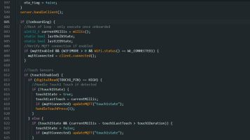

# Modifying the Firmware

This section is not meant to be an Arduino IDE tutorial nor will it cover the specifics of using C++, HTML, CSS or Javascript.  But it will provide an overview of how the firmware is organized and the basic steps of how to setup the Arduino IDE and flash your own custom firmware.

