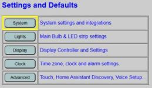
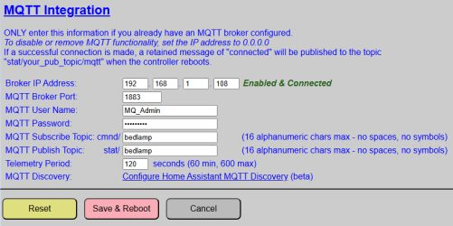
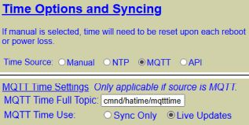

# MQTT Setup and Topics
{: .no_toc }

---

<p align="center">
  
</p>

If you wish to use MQTT with the system, you must meet a few prerequisites and also enable and configure MQTT in the web application.

### Prerequisites
To use MQTT you must have a local MQTT broker available on your network. While you can technically use a cloud-based MQTT provider, this is not recommended due to the lag introduced between sending a command and having it received by the system. One of the most popular free versions is [Eclipse Mosquitto](https://mosquitto.org/).

If you are a Home Assistant user, you can turn Home Assistant into your MQTT broker by installing the MQTT broker add-on.

---

### Understanding Topics
MQTT works using a subscribe/publish method. The system allows you to define these topics, and your external system must use these same topics for proper communication.

* **Publish (stat/):** All messages sent by the lamp are published to a topic prepended with `stat/`.
* **Subscribe (cmnd/):** All topics subscribed to by the lamp are prepended with `cmnd/`.

---

### Enabling and Configuring MQTT
MQTT configuration is found under the primary controller's **System Settings and Integrations**.



The MQTT setup section is located near the bottom of the page.



* **Broker IP Address:** Enter the IP address of your MQTT broker.
* **MQTT Broker Port:** Default is `1883`.
* **MQTT User Name / Password:** Enter the account credentials for your broker.
* **Subscribe Topic:** Specify up to 16 alphanumeric characters. The system prepends `cmnd/`. Example: `cmnd/bedlamp/*`.
* **Publish Topic:** Specify up to 16 alphanumeric characters. The system prepends `stat/`. Example: `stat/bedlamp/`.

> **⚠️ Topics**<br>For most brokers, topics are **case-sensitive**.  As a best practice, only use lowercase letters and numbers in your topics.  Spaces and symbols are not permitted.
{: .warning }

> **💡 Integration Tip**<br>Since the system prepends `stat/` and `cmnd/` automatically, you can use the same string for both (e.g., `bedlamp`) to simplify your naming convention.
{: .note }

#### Maintenance & Buttons
> **⚠️ Important: Global Page Buttons**<br>Unlike some other settings pages, there is only ONE set of buttons at the bottom of the page. These buttons apply to **ALL** fields and integrations on the page (WiFi, Weather, etc.).
{: .important }

* **Reset Button:** Restores any changed values back to the current saved configuration.
* **Save and Reboot:** Saves all current values on the page. Both the **Primary and Display** controllers will reboot.
* **Cancel Button:** Discards changes and returns to the main menu.

---

## MQTT State (Publish) Topics
The system publishes current values and diagnostic data to the broker. All state topics are published with the **Retain** flag set to **TRUE**.

### Diagnostic / Boot Topics
These values are published only at boot time, except for LWT (status) which is updated by the broker.

|Topic Suffix|Payload Type|Example/Range|Notes|
|:---|:---:|:---:|:---|
|`/bulb/ipaddr`|String|192.168.1.52|RGBW Light Bulb IP address|
|`/bulb/status`|String|online or offline|Bulb Last will and testament. (LWT)|
|`/display/ipaddr`|String|192.168.1.51|Display controller's IP address|
|`/display/lastboot`|date-time string| 2026-04-02 14:38|Date/Time display last booted|
|`/display/macaddress`|String|08:B6:1F:3C:1F:B0|WIFI MAC address of display ESP32|
|`/primary/ipaddr`|String|192.168.1.50|Primary controller's IP address|
|`/primary/macaddress`|String|04:83:08:42:14:B8|WIFI MAC address of primary ESP32|

### Entity State Topics
Formatted as `stat/[your-publish-topic]/[topic-suffix]`.

|Topic Suffix|Payload Type|Example/Range|Notes|
|:---|:---:|:---:|:---|
|`/alarms`|JSON |*See note below|A JSON array of current alarm sesttings|
|`/alarmtrack`|number| 0 - 20 |Indicates the current index/track for alarm sound|
|`/alarmvolume`|number|0 - 30|Current max volume level for alarms|
|`/gentlewake`|ON / OFF|ON|Current state of the alarm Gentle Wake feature|
|`/snoozetime`|number|0 - 60|Snooze length duration (in minutes)|
|`/bulbbrightness`|number|0 - 255|Current brightness level of the light bulb|
|`/bulbcolor`|String| 255,0,0|Red, green, blue values for current bulb color. Will be updated to white (255,255,255) when bulb is in color_temp mode.|
|`/bulbmode`|String| 'color_temp' or 'rgb'|Last mode of the light bulb.|
|`/bulbstate`|String| ON or OFF|Current state of the light bulb. Always published in upper case.|
|`/bulbtemp`|number| 150 - 350 | White temperature, in mireds, when the bulb is in color_temp mode.|
|`/clockcolor`|Hex String|#ffffff|Current color of the clock display. Published as a hex color _with_ the leading pound sign (#)|
|`/dispbrightness`|number|0 - 255|Current brightness value of the display|
|`/autodim`|ON / OFF|OFF|Current state of the display's auto-dimming feature.|
|`/ledbrightness`|number|0 - 255|Current brightness of the LED strip. May indicate 0 when LED strip is off.|
|`/ledcolor`|String| 0,255,0|Current RGB color of the LED strip: rr,gg,bb where each value can range from 0-255.|
|`/ledstate`|String| ON or OFF|Current state of the LED strip. Always published in upper case.|
|`/temperature`|number| 71|If temperture is synced, then the last temperature value received. Value will be output in the same units as configured under the temperature integration (°C or °F). If not integrated, will show 0.|
|`/timesync`|String| 'OK' or 'FAIL'|If time is synced to an external source, indicates success of last sync.|
|`/touch1func`|String| see notes |Current primary function for Touch Sensor 1. Possible values are:<br>None, Toggle Bulb, Toggle LEDs, Bulb Brighter, Bulb Dimmer, LEDs Brighter, LEDs Dimmer, Display Brighter, Display Dimmer|
|`/touch1funca`|String| see notes |Current alarm function for Touch Sensor 1. Possible values are:<br>None, Snooze, or Stop|
|`/touch2func`|String| see notes |Current primary function for Touch Sensor 2. Same possible values as Sensor 1.|
|`/touch2funca`|String| see notes |Current alarm function for Touch Sensor 2. Same possible values as Sensor 1.|

> **💡 Alarm JSON Payloads**<br>The `/alarms` topic publishes the entire saved alarm array. It is contingent upon your external system to deserialize this JSON to utilize the values.
{: .note }

```json
[
  {
    "index": 1,
    "active": 0,
    "date": "2026-04-06",
    "time": "09:19",
    "repeat": 0
  },
  {
    "index": 2,
    "active": 0,
    "date": "2026-02-18",
    "time": "11:58",
    "repeat": 4
  },
  {
    "index": 3,
    "active": 1,
    "date": "2026-02-24",
    "time": "14:13",
    "repeat": 9
  },
  {
    "index": 4,
    "active": 1,
    "date": "2026-04-06",
    "time": "07:30",
    "repeat": 5
  },
  {
    "index": 5,
    "active": 0,
    "date": "2025-10-28",
    "time": "07:58",
    "repeat": 7
  }  
]
```
Numeric repeat values correspond to 0=None, 1=Sunday, 2=Monday. 3=Tuesday, 4=Wednesday, 5=Thursday, 6=Friday, 7=Saturday, 8=Weekends, 9=Weekdays.

---

## MQTT Command (Subscribe) Topics
The lamp is a very attentive listener. It watches these specific topics for commands; just ensure your syntax is perfect, or the lamp will politely ignore you. Commands should be published with a retain flag of **FALSE**. Format: `cmnd/[your-subscribe-topic]/[topic-suffix]`.

|Topic Suffix|Payload(s)|Example|Notes|
|:---|:---:|:---:|:---|
|`/alarmactive`| alarm_num:active | 2:0 | Sets active state (1=on, 0=off). Values must be separated with a colon and no spaces.|
|`/alarmtrack`| number| 4|Sets alarm track index (0-20) for all alarms.|
|`/alarmupdate`| **snooze** or **stop** | snooze | Immediately snoozes or stops a sounding alarm. Ignored if idle.|
|`/alarmvolume`| number | 23 |Sets alarm volume (0-30). 0 may result in no sound.|
|`/gentlewake`| **OFF**/**ON** or **0**/**1**|ON|Enable or disable the alarm gentle wake feature.|
|`/snoozetime`| number | 10 |Sets snooze length (0 - 60 minutes). 0 disables snoozing.|
|`/playalarm`| number | 5 |Plays the current alarm track for the specified number of seconds.|
|`/setalarm`| JSON* | (See below) |Used to set or update a specific alarm slot.|
|`/bulbbrightness`|number| 128 |Sets bulb brightness. **Also toggles bulb ON if off**.|
|`/bulbcolor`| RGB or Hex String | #00ff00 | Sets bulb color. **Also toggles bulb ON if off**. Sets mode to `rgb`.|
|`/bulbtemp`| number | 250 | Sets bulb white temp (150-350). **Also toggles bulb ON if off**. Sets mode to `color_temp`.|
|`/bulbstate`|**OFF**/**ON** or **0**/**1**|ON| Sets the power state of the light bulb.|
|`/bulbrestart` | 1 | 1 | Issues a command to reboot the RGBW bulb.|
|`/clockcolor`| RGB or Hex String | #ffffff | Sets the color of the clock display (rr,gg,bb or #hex).|
|`/dispbrightness`|number| 128 | Sets display brightness (0-255). Auto-dim should be disabled first.|
|`/autodim`| **OFF**/**ON** or **0**/**1**|OFF|Enable or disable display auto-dimming.|
|`/settime`| Datetime String | 2026-04-01 14:30:00 | Sets date/time (yyyy-mm-dd hh:mm:ss). Uses 24-hour format.|
|`/settemperature`| number | 72 | Sets temperature raw value. Only applicable if weather source is MQTT or API.|
|`/ledbrightness`| number | 96 | Sets LED brightness (0-255). **Also turns LEDs ON if off**.|
|`/ledcolor`|RGB or Hex String | #60ff80 | Sets LED color. **Also turns LEDs ON if off**. #000000 appears as OFF.|
|`/ledstate`| **OFF**/**ON** or **0**/**1**|ON| Sets the power state of the LED strip.|
|`/touch1func`| number | 2 | Sets primary function for sensor 1 (Values 0-8).|
|`/touch1funca`| number | 1 | Sets alarm function for sensor 1 (Values 0-2).|
|`/touch2func`| number | 7 | Sets primary function for sensor 2 (Values 0-8).|
|`/touch2funca`| number | 2 | Sets alarm function for sensor 2 (Values 0-2).|
|`/displayrefresh`| 1 | 1 |Forces an immediate republish of all topics from the display controller.|
|`/primaryrefresh`| 1 | 1 |Forces an immediate republish of all topics from the primary controller.|
|`/refreshall`| 1 | 1 |Forces an immediate republish of all topics from **ALL** controllers.|
|`/displayrestart`| 1 | 1 | Forces an immediate reboot of the display controller.|
|`/primaryrestart`| 1 | 1 |Forces an immediate reboot of the primary controller.|
|`/restartall`| 1 | 1 | Forces an immediate restart of all THREE controllers.|
|`/dispsaveconfig`| 1 | 1 | **CAUTION:** Saves active values as new boot defaults and reboots.|
|`/primsaveconfig`| 1 | 1 | **CAUTION:** Saves active values as new boot defaults and reboots.|

> **💡 Alarm JSON Payloads**<br>To set an alarm via MQTT, you must create the alarm settings as a JSON payload.  The structure of the payload is as follows:
{: .note }

```
{
  "alarmnum": 3,
  "active": 1,
  "date": "2026-04-06",
  "time": "16:30",
  "repeat": 0
}
```

|Key|Value|Description 
|--|:---:|--- 
| alarmnum | 1 - 5 | Alarm “slot” number you are editing or updating 
| active | 0 or 1 | Sets alarm as inactive (0) or active (1) 
| date | date string | Alarm date. Must be in yyyy-mm-dd format 
| time | time string | Alarm time. Must be in hh:mm in 24-hour (military) format 
| repeat | 0 - 9 | Repeat setting. Valid values are:<br>0 = None<br>1 - 7 = Sunday, Monday, Tuesday…Saturday<br>8 = Weekdays<br>9 = Weekends

---

### Special MQTT Time Topic
If you opt to use MQTT time for syncing, a special independent topic is used. This allows you to leverage existing time-broadcasting automations (e.g., from Home Assistant).  See [Clock and Time]({{ '/time' | relative_url }}) for more information on setting a time MQTT topic.

<p align="center">
  
</p>

> **⚠️ Reliability Warning**<br>If using MQTT as a "live" time source and the broker or WIFI goes down, time will not be updated on the clock until the broker/WIFI is restored. This could result in missed alarms.
{: .warning }

<div style="display: flex; justify-content: space-between; align-items: center; margin-top: 40px; border-top: 1px solid #333; padding-top: 20px;">
  <a href="{{ '/integrationmain' | relative_url }}" class="btn btn-outline"><- Previous: Using MQTT and the API</a>
  <a href="{{ '/api' | relative_url }}" class="btn btn-purple">Next: API HTTP Command List -></a>
</div>