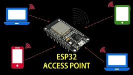
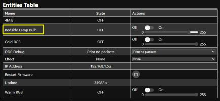
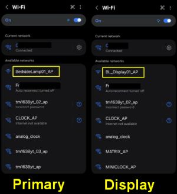
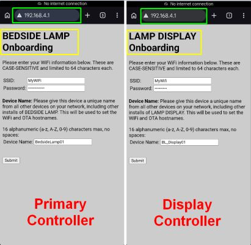
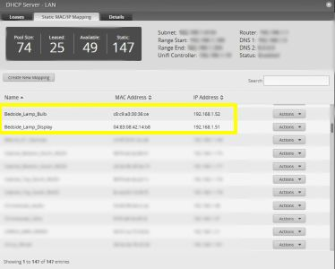

# Onboarding and First Time Setup
{: .no_toc }

---

  

Once you have successfully flashed the firmware to your Primary and Display controllers, the next step is to connect them—along with your RGBW bulb—to your local Wi-Fi network. 

**🌐 Local Network Reminder** While these devices require a Wi-Fi connection to communicate with each other, they **do not** require active internet access for core functionality. External services (like Home Assistant or OpenWeatherMap) are entirely optional.
{: .note }

---

## 1. Kauf RGBW Wi-Fi Bulb
Follow the instructions provided with your bulb to complete its initial Wi-Fi setup. While the process is similar to the controllers below, there is one specific detail you must capture for the system to function: the **ESPHome Device Name**.

### Finding the Device Name
If you are not using Home Assistant, locate the IP address assigned to the bulb by your router and enter it into a web browser. This opens the bulb’s native interface.

The default name is typically something like `Kauf Bulb 8a37db`. If you choose to rename the bulb (via Home Assistant or the ESPHome dashboard), ensure you do so **before** configuring the lamp's interface settings.

### Converting to the "HA Standard"
Later in the setup, you will need to provide the bulb's name in the **Home Assistant entity format**. 
* **The Rule:** Convert all letters to lowercase and replace all spaces with underscores (`_`).

| Original Name | HA Entity Format |
| :--- | :--- |
| Bedside Lamp Bulb | `bedside_lamp_bulb` |
| Kauf Bulb 8a37db | `kauf_bulb_8a37db` |

*Note: Write down both the bulb's **IP Address** and this **Entity Name**.*

---

## 2. Primary and Display Controllers
You must perform this process twice—once for each controller. 

### Step 1: Join the Hotspot
Once flashed, the controller will broadcast its own Wi-Fi network. It’s essentially a very tiny, very exclusive club where the only item on the menu is "Configuration." If your phone warns you that the "Network has no Internet access," take a deep breath and tell it everything is fine. We aren't here to browse cat memes; we’re here to give a lamp its identity.

The default hotspot names for the Wi-Fi hotspots are:
* **Primary:** `BedsideLamp01_AP`
* **Display:** `BL_Display01_AP`

Use a phone, tablet, or laptop to join the hotspot. Remember, if your device warns you that there is "No Internet Connection," select **Stay Connected**.

### Step 2: Access the Onboarding Form
Open a web browser and enter the IP address: **`192.168.4.1`**. The onboarding form will appear:

Fill out the following fields:
* **SSID:** Your Wi-Fi network name (must be the same for all three devices).
* **Password:** Your Wi-Fi password.
* **Device Name:** A unique, short name (up to 16 alphnumeric characters plus the underscore (_), no spaces). 
    * *Example:* `lamp_primary` and `lamp_display`. 
    * Each controller on your network **must** have a unique name.

### Step 3: Submit and Verify
Click **Submit**. The controller will reboot and attempt to join your network. If successful, the hotspot will disappear. You should now be able to see the device and its new IP address in your router’s client list.

---

## 3. Assign Static or Reserved IP Addresses
**This step is strongly recommended for system stability.**
{: .label .label-yellow }

The controllers communicate with each other using IP addresses. If your router reassigns a new IP to one of the devices (due to a power failure or lease expiration), the system will stop functioning.

1. Open your router's configuration page.
2. Create a **Static Reservation** for the Bulb, Primary Controller, and Display Controller.
3. Power cycle each device to ensure they are using the newly assigned static IPs.

---

## 4. Final Hardware Integration
At this point, you should move your controllers from your computer to their final positions (either on a breadboard or inside the lamp housing). 

**It is critical to connect all peripherals** (touch sensors, LED strips, DFPlayer, etc.) before proceeding. The firmware looks for these components during the boot process; if they are missing, the system may not initialize correctly.

### Build Resources
If you haven't completed the physical build yet, refer to these guides:
* **[YouTube Overview]({{site.links.youtube_video}})**
* **[Written Build Guide](https://resinchemtech.blogspot.com/2026/03/ultimate-bedside-lamp.html)**

Once your hardware is connected and powered, proceed to the [System Interfaces]({{ '/interfaces' | relative_url }}) section.

  <a href="{{ '/installation' | relative_url }}" class="btn btn-outline"><- Previous: Installation</a>
  <a href="{{ '/interfaces' | relative_url }}" class="btn btn-purple">Next: System Interfaces -></a>

