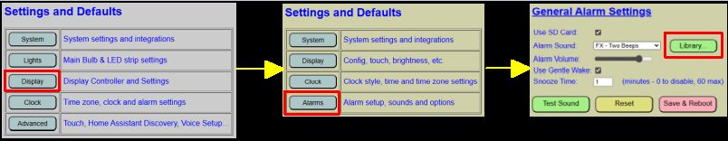
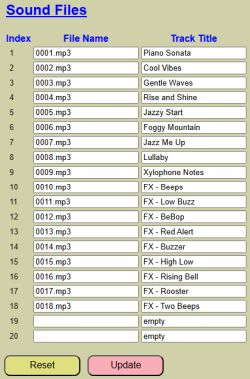

# Setting Up Alarm Sounds

Sounds for alarms are stored on a microSD card that is installed in the DFPlayer, that also handles playing these files.  However, the DFPlayer and code library has some pretty specific requirements for how these files are organized.  The written [Build Guide](https://resinchemtech.blogspot.com/2026/04/ultimate-bedside-lamp.html) contains full details on the DFPlayer, installation and also covers the proper setup of the files on the microSD card.  I'll reiterate the major steps here, but you may also want to refer to the build guide for step-by-step instructions on how to place audio files on the SD memory card, including the types/sizes of SD cards supported.

### Supported Sound Files
Any .mp3 file can be used as the alarm sound.  Shorter length audio files (< 30 seconds) are recommended.  The system will 'loop' any sounds to create a continuous alarm.  If you have a full song, it is recommended that you use an audio editor and trim or cut out a 30-60 second clip from the song, although techncially this isn't required.

A list of royalty free songs and sound effects are provided in the repo's /sounds folders. You can use any, all or none of these for your install.  But note that you will need to rename these, or any of your own, .mp3 files according to the instructions below.

The alarm sound can be selected from any of the first **20** tracks listed on the microSD card, but you can theoretically add up to 255 tracks.  Why have tracks beyond 20?  Even though the alarm sound can only be selected from one of the first 20 tracks, MQTT and the API can be used to play _any_ of the listed tracks and not just from the first 20.  See the sections on MQTT and API for more information on how to play a sound remotely.

### Naming and Transferring Sound Files

The microSD card used should be between 8-32 GB in size and must be formatted as FAT32.  The audio tracks need to be copied to the root of the microSD card and must adhere to the following naming format:

- 0001.mp3
- 0002.mp3
- 0003.mp3
- 0004.mp3
- 0005.mp3
- etc...

In addition to the sequential naming format, the files also need to be _copied_ in sequential format to the microSD card.  If you do a bulk copy/paste of multiple files, there is no guarantee that the physical file location will match the sequential order of the file names.  To be sure, you should copy files, one at a time and in order, to the microSD card.  You can add up to 255 files (named 0001.mp3 thru 0255.mp3) but only the first 20 files will be selectable as the alarm sound.

Of course using these generic numeric file names leads to another issue... what is each track?  After a few months, you may not remember what sound 0007.mp3 is.  Of course you could play/test each sound but instead, the application will allow you to specify a track or sound name to each numeric track for easy reference.  After you copy your .mp3 files to the SD card, the first thing you should do is assign track names.

#### Setting up the Sound Library and Assigning Track Names.

Once you have your files on the microSD card, the first place to go is the sound library.  To reach this from the primary app, first select 'Display

This will open up the sound library configuration page (the other alarm settings are covered in the next section)

When you initially open up the sound library, all file names will be blank and all the track titles will show _empty_.  

#### _File Name_
Simply enter the actual sequential file name (e.g. 0001.mp3) in the file name field.  This must exactly match the actual file name _and order_ that the files are physically located on the SD card (this is represented by 'Index' on the page).  If you bulk copied your files, they may not be physically located in the same order as the file name.  If after creating the library you find that the tracks are in the wrong order (for example, file 0005.mp3 is in index 7 and file 0007.mp3 is in index 5), just change the order of the file names to match the physical index.

#### _Track Title_
Once you have the file names in the correct position, you can assign a meaningful name to each track.  You can use the actual track title or any descriptive name you prefer.  In my example above, the first nine tracks are musical tracks.  But the last nine are sound effects.  To keep these straight, I opted to add "FX" to the start of each sound effect track.  But how you name the tracks are up to you.  The tities, as you will soon see, will be shown in a convenient drop down for selecting the alarm sound.

For any unsued tracks (these should appear at the end of the list), leave or enter a track title of _empty_. This is required and the track name cannot be blank.

#### _Reset Button_
The sound library is saved to a sound libary configuration file.  This is separate and distinct from the main configuration file covered elsewhere.  But if you want to reload the current saved values (assuming you've created and saved the sound library at least once), clicking "RESET" will reload the previously saved library settings.

#### _Update Button_
This will write the current library to the sound configuration file.  Changes are immediate and like many other configuration changes, this one does not require a reboot.  Be sure to click "UPDATE" after making any changes.  If you navigate away from this page without clicking "UPDATE", all changes will be lost.

