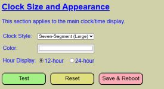
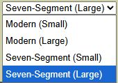
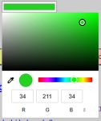
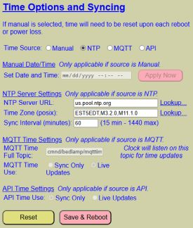
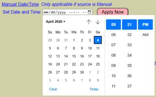
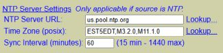
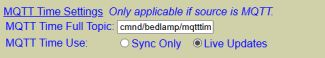

# Clock and Time Settings

The clock and time settings are used both to control how the clock appears on the display and also to set up the date/time sync source.  While both sections appear on the same web page, they operate independently.

### Clock Size and Appearance

These settings control how the clock appears on the display.  Note that unlike mnay other settings the clock size and appearance only has **DEFAULT** settings.  This means there are no **ACTIVE** settings for changing the clock appearance 'on-the-fly'.  Any changes to these settings **require** a save & reboot to be applied to the clock's appearance.

#### _Clock Style_
Currently the system offers four different options for displaying the time.  

Future firmware upgrades may offer additional styles.  Pick your desired style for the time display.  Use the 'TEST' button if you want to see what each style looks like before saving it as the new default.

#### _Clock Color_
You can also specify the color used to display the time on the display.  This uses the same color picker as described for selecting the LED strip and light bulb colors.

You can select the color via the slider and picker box, the eyedropper to select any color on your desktop or manually enter RGB, HSL or a Hex color code (switch the manual input units with the small arrows).  Again, you can use the "TEST" button to try out colors before saving.

#### _Hour Display_
Select whether you want the time shown in 12-hour (am/pm) format or 24-hour (aka 'military') time.  You must save changes for this to be applied.

#### _Test Button_
Click the test button to try out the style, color and/or the hour display selections.  The display will update using these values.  Click "STOP" to end the test and return to editing mode.

#### _Reset Button_
This will reset any changed values back to the last saved default values.

#### _Save & Reboot Button_
To make the changes to the clock's appearance permanent, you must click the 'Save & Reboot' button.  This will write your changes to the configuration file, reboot the controller and load your new settings as the default.  Note that this is currently the only way to change the clock's appearance.  There are no **ACTIVE** controls to temporarily change these settings.

### Setting the Time And Time Sync Options
The settings are used to set the date/time and optionally set up a source where the time is initially obtained when the system boots and to occasionally "sync" the time to an external source.  If the system isn't able to sync to a time source at boot (e.g. manual source is used), then the date/time will always start at 12:00 am (midnight) with a date of January 1, 2026.

_A side note on how time works on the ESP32_

The ESP32 has an internal real-time clock (RTC) where it can keep the approximate time based on elapsed milliseconds since the last boot occurred.  However, when it first boots, it has no way to determine the current time, time zone, etc.  If you manually set the date and time, the ESP32 will use this and then its own internal clock to keep the time somewhat up-to-date.  However, due to other processing demands, the internal RTC isn't highly accurate and you will likely see a small drift over time (this will vary, but can be a few seconds per day... which can add up over time).

For best accuracy (and to make the correct time available upon booting), you can sync the time to an external source.  

_Note_: For this section, certain fields are enabled/disabled based on the time source selected.  If a field isn't applicable, it is disabled by default.

#### _Time Source_
Currently, there are four ways to set/synchronize the time:
- _Manual_: You manually specify starting the date and time.  Note that when selecting this method, the current date and time will be lost upon a reboot/power-on and the date/time will have to be manually set again.

- _NTP_: You can initially set the time and occasionally 'resync' the time against an NTP server.  This can be a remote NTP server (Internet connection required) or a local NTP server if you have one available on your network.  How to setup an NTP source is covered below.

- _MQTT_: The time can be received for initial setting, and optionally resyncing, via MQTT.  This does require that you setup and enable MQTT.  Enabling MQTT requires that you have an MQTT broker available, but use of MQTT is entirely optional.  See the section on [MQTT Setup & Topics](/mqtt.md) for more information on 
configuring MQTT for use.  Specific information setting up time syncing via MQTT is covered below.

- _API_: The system makes an HTTP API available.  It is possible to both set and sync the time using the API.  More information is provided below.

As a general rule, time accuracy and syncing goes from the most to least accurate as follows:

NTP > MQTT > API > Manual

The remain fields cover setting up the individual sources.  Only applicable fields are enabled.

#### _Manual Date and Time Source_
When you select 'manual' as the time source, the Set Date and Time field and the "Apply Now" button are enabled.  If you click in the date/time field, a date and time picker will appear.

You can use the pickers to set the current date and time or you can simply type the values into the text box.  If you manually enter the date and time it **must** be in the format of mm/dd/yyyy hh:mm am/pm.  For example: 04/06/2026 11:27 am

After either selecting or entering in the correct date and time, click the APPLY NOW button and the clock will be updated.  The clock will then be maintained until power is lost or the controller is rebooted, at which point the time will be reset to midnight on January 1, 2026 and a manual entry will be required again.

#### _Network Time Protocol (NTP) Source_

This is the recommended method as it will always set the clock whenever the controller boots up. It will also maintain accuracy better than any of the other methods through an occasional resync with the server.  However, unless you have a local NTP server on your network, this method will require that you allow the system to have Internet access.  There are a multitude of free-use servers that can be used, but ideally, you should select a time server nearest your physical location or at least from your local country.

- **NTP Server URL**: Set the location of the server you wish to use.  You can use the 'Lookup...' link to launch a separate browser tab for the NTP Pool Project site.  This lists available NTP servers (current over 6,000) broken down by country/location.  Simply browse to the best server for your location and note the URL.  Enter this in the field.  In my example, I'm using the generic us.pool.ntp.org server to get the date and time.  If you do have a local NTP server, you can use a local address.

- **Time Zone** (POSIX): NTP doesn't know anything about your particular time zone, so you need to specify that in the Time Zone field.  Note that this is entered in a special POSIX format.  While you can manually type in this string if you know it, a much better way is to use the 'Lookup...' link for time zones.  This will open a new tab and load a Github site that lists the world's time zones along with the POSIX string for each one.  Simply locate your time zone/location and copy the listed POSIX string, pasting it in the Time Zone field.  For my example, I'm using US. Eastern Standard time.  However, if you are in a time zone that observes daylight savings time, that is indicated in the string as well and the clock will automatically adjust the time when daylight savings time starts and ends.

- **Sync Interval**: This tells the system how often to poll the NTP server and sync the current time.  Note that it has a **minimum** sync inteval of 15 minutes.  Most servers limit how often you can call the API and the most common value is 15 minutes.  Trying to refresh using a shorter interval will most likely lead to your call being ignored, but repeated requests over a short time could technically lead to a ban.  To be honest, the internal RTC will only drift a few seconds a day under normal operation, so you reallly don't need to sync any more often than every few hours.  The settings does have a maximum sync setting of 1,440 minutes (24 hours), so the time will sync at least once a day.

#### _MQTT Time Source_

The clock can get the initial time, and optionally update the time, from MQTT.  This does require an MQTT broker, a system that publishes the time once per minute, and MQTT must be configured for use by the clock.  More information on setting up and using MQTT can be found under the [MQTT Setup & Topics](/mqtt.md) section so I won't cover those details here.

- **MQTT Time Topic**: The clock will subscribe and listen to this special topic to get or update the time.  This topic can be different from the more generic MQTT topic used for MQTT setup.  Your external system should publish the time to this same topic.
  - When using an external system, the time must be posted in yyyy-mm-dd hh:mm:ss format.  In addtion, the time must be in 24-hour (aka military) format.  So times from  00:00-11:59 will be considered AM and 12:00-23:59 will be considered PM.

- **MQTT Time Use**: This indicates how you want to use MQTT time in relationship to the clock
  - _Sync Only_: Time will be obtained from MQTT and the clock will be set upon intial power-on or reboot of the system.  After the time is set, the system will run solely off the internal RTC.  No re-syncing will occur.

  - _Live Updates_: When this option is selected, the internal RTC is ignored.  Time is set at boot time and **only** updates when a new MQTT message is published.  Using this option requires an external system, like Home Assistant, that can publish a new MQTT message every time the minute changes.  If you have a reliable system and broker, this approach can approach the accuracy of NTP.

#### _API Time Source_

In a similar manner to MQTT, the time can be set and updated via an HTTP API command.  See the section on the [API HTTP Command List](api.md) for more information on how to use the API.  However, like MQTT, an external system is required to send the time API command to the clock.

- _Sync Only_: Time will be set after receiving a valid time via the API. When the system first starts up or reboots, the time will initially show 12:00 am (midnight) until a valid API command is received.  After initially setting the time, the internal RTC will be used for time updates.

- _Live Updates_: Time will only be set **and updated** when a valid time API command is received.  Time will remain static and will not update until an API command is received.  For this option, you'll need an external system that can send a time update once a minute.

See the [API HTTP Command List](api.md) topic for the format required to set the time via API.

#### _Reset Button_
Use the reset button to restore any changed values back to the currently saved defaults, including the original time source.

#### _Save and Reboot Button_
To save your current settings as the new boot defaults, click the SAVE & REBOOT button.  This will save your current time source and settings to the configuration file.  The system will reboot and load the new defaults, including syncing the initial time if applicable. 