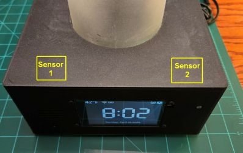
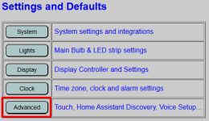
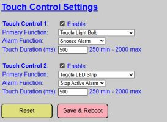
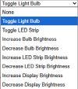
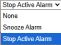
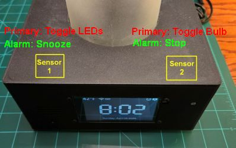

# Defining and Using the Touch Sensors
{: .no_toc }

---

  

If built as described in the [Build Article](https://resinchemtech.blogspot.com/2026/05/ultimate-bedside-lamp.html), the lamp includes two TTP223 capacitive touch sensors mounted under the lid. These sensors are highly sensitive and function through non-conductive materials like PLA (tested up to 5mm) or wood.

> **⚠️ Material Warning** Touch sensors will not function through metallic or other conductive surfaces. Additionally, ensure the sensors are placed at least 3-4 inches (7-10 cm) apart; if they are too close, triggering one may accidentally trigger the other.
{: .warning }

> **🔍 Dealing with Ghosts in the Machine** Capacitive touch is magic until it isn't. If your lamp starts turning itself on and off like it's haunted, your sensitivity thresholds are likely set too low. High humidity or a stray charging cable resting near the sensor can trick the ESP32 into thinking a finger is present. Unless you're looking for a supernatural roommate, a quick adjustment to the duration usually clears things up.  If necessary, you can also add a capacitor to the TTP223 sensor to reduce its native sensitivity.
{:  .note }

---

### Configuring the Sensors
The touch control settings are found under the **Advanced** settings on the primary controller's main web page.

Each sensor is configured independently. You must check the **Enable** box for each sensor you have installed to allow the firmware to read the hardware.

***Dual-Function Logic*** 
Each sensor can be assigned two distinct roles based on the current state of the lamp:
* **Primary Function:** The action executed when a touch is detected while the alarm is idle or in a "Snooze" state.
* **Alarm Function:** The action executed specifically while an alarm is actively sounding.

---

### Primary Function Options
When the lamp is in its normal state, you can select from the following actions:

* **None:** No internal action is taken.
    > **💡 MQTT Integration** Even if set to **None**, a sensor will still send an MQTT message if MQTT is enabled. This allows you to use the touch sensors to trigger external automations in Home Assistant without affecting the lamp's internal state.
    {: .note }
* **Toggle Light Bulb / LED Strip:** Taps toggle the power state (On/Off).
* **Brightness Controls (Bulb & LED Strip):** Taps increase or decrease brightness by ~10%. 
    * **Wrap-Around:** Reaching 100% brightness and tapping again will "wrap" the value back to the dimmest setting.
    * **Note:** The light must be **ON** for these touches to register; they will not turn on a light that is currently off.
* **Brightness Controls (Display):** Increases or decreases display brightness by ~10%.
    * **No Wrap:** Unlike the lights, the display brightness will **not** wrap around. It will stay at the maximum or minimum value.
    > **💡 Auto-Dim Override** If [Auto-Dimming]({{ '/autodim' | relative_url }}) is enabled, it will eventually overwrite manual brightness changes made via touch. If your display brightness "snaps back" after a touch, check your Auto-Dim settings.
    {: .note }

---

### Alarm Function Options
The Alarm Function is active only while an alarm is sounding. If an alarm is currently snoozed, the sensors revert to their **Primary Function** until the alarm resumes.

* **None:** No action is taken when the sensors are tapped during an actively sounding alarm.
* **Snooze Alarm:** Taps trigger the snooze period. The sensor then returns to its primary function until the snooze expires.
* **Stop Alarm:** Taps fully deactivate the sounding alarm. The sensor returns to its primary function immediately.

---

### Touch Duration (Debounce)
The **Touch Duration** (entered in milliseconds) determines how long a finger must remain on the sensor for a touch to register. This acts as a hardware "debounce."

> **💡 Calibration Hint** Because these sensors are extremely sensitive, a single quick tap might register as 2 or 3 separate touches (e.g., toggling a light on and immediately back off). A value of **500 ms** is a good starting point. If you experience "double-touches," slowly increase this value. The range is 250 ms to 2,000 ms.
{: .note }

---

### Combining Sensor Uses
By utilizing two sensors with dual functions, you can create versatile control schemes. 

In this common setup:
1. **Normal State:** Left sensor toggles the LED strip; Right sensor toggles the Bulb.
2. **Alarm State:** Left sensor becomes "Snooze"; Right sensor becomes "Stop."
3. **Morning Workflow:** When the alarm sounds, you can tap the Left sensor to snooze. Later, when it sounds again, tap the Right sensor to stop the alarm. Because the sensor immediately reverts to its primary function, a second tap on that same Right sensor will turn on the main light bulb for you.

---

### Maintenance
* **RESET:** Reverts only the Touch Sensor section to the last saved defaults.
* **SAVE AND REBOOT:** Commits settings to flash memory and restarts the controller. **Note:** You must save and reboot to test different configurations, as there is currently no "Live Test" button for touch sensors.

---

  <a href="{{ '/weather' | relative_url }}" class="btn btn-outline"><- Previous: Temperature and Weather</a>
  <a href="{{ '/usingmain' | relative_url }}" class="btn btn-purple">Next: General System Use-></a>

