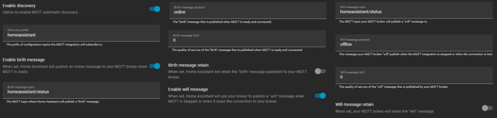
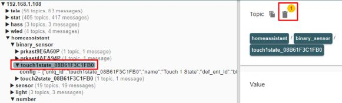

# Home Assistant & MQTT
{: .no_toc }

---

  

Most Discovery issues are the result of a configuration mismatch or a "stuck" message in the MQTT broker. Because MQTT is a middle-man service, troubleshooting often requires a utility that allows you to see exactly what is being broadcast. 

I highly recommend **[MQTT Explorer](https://mqtt-explorer.com/)**. It is a free, open-source tool that acts as a window into your broker, allowing you to see if the lamp is actually talking and what it’s saying.

---

### No Device or Entities Created
If you run the Discovery process in the web app but nothing appears in Home Assistant, verify the following:

* **Prerequisites:** Ensure you’ve met all the steps in the [MQTT Setup & Topics]({{ '/mqtt' | relative_url }}) section.
* **The Integration:** Ensure you have installed the **MQTT Integration** within Home Assistant itself. This is separate from the Mosquitto broker add-on.
* **Default Settings:** Discovery relies on standard Home Assistant conventions. If you have changed the default settings of the MQTT integration in HA, Discovery may fail.

#### Home Assistant MQTT Default Parameters
Ensure your Home Assistant MQTT configuration matches these standard values:

| Parameter | Value | | Parameter | Value |
| :--- | :---: | :--- | :--- | :---: |
| **Enable Discovery** | `ON` | | **Birth message retain** | `OFF` |
| **Discovery Prefix** | `homeassistant` | | **Will message topic** | `homeassistant/status` |
| **Enable birth message** | `ON` | | **Will message payload** | `offline` |
| **Birth message payload** | `online` | | **Will message QoS** | `0` |
| **Birth message QoS** | `0` | | **Will message retain** | `OFF` |

---

### Deleted Entities Reappear
If you delete a device in Home Assistant but it "ghosts" back into existence after a reboot, you likely have a **retained message** in your MQTT broker. 

Usually, using the **REMOVE DISCOVERY** button in the lamp's web app prevents this. However, if you’ve reset your controller or replaced the hardware, the old "discovery" messages might still be sitting on your broker, telling Home Assistant that the old device still exists.

#### Cleaning Up "Stuck" Topics
To manually purge these messages using MQTT Explorer:
1. Locate the `homeassistant/` topic.
2. Navigate through the sub-topics (e.g., `binary_sensor`, `light`) to find the entry matching your old device name.
3. Highlight the specific topic and click the **Trash Can** icon to delete it from the broker.

> **⚠️ Proceed with Caution** Only delete topics created by the Discovery process. Deleting other retained messages in your broker may impact or disable other smart devices in your home. When in doubt, refer back to the [Home Assistant Discovery]({{ '/discoverymain' | relative_url }}) section for a full list of entity names.
{: .warning }

---

  <a href="{{ '/troubleoperation' | relative_url }}" class="btn btn-outline"><- Previous: Daily Operation & Config Issues</a>
  <a href="{{ '/troublefaq' | relative_url }}" class="btn btn-purple">Next: FAQ & Getting Help -></a>

