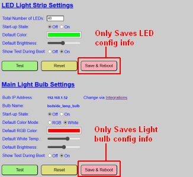
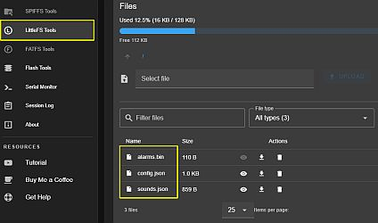

# Daily Operation & Configuration
{: .no_toc }

---

  

If your lamp is up and running but you find that settings aren't sticking or updates aren't applying, you’ve likely encountered a configuration "hiccup." This section covers how the system saves data and how to verify what’s actually happening under the hood.

## Configuration & Persistence Issues
If you make changes to your setup and they seem to vanish after a reboot, check the following:

### RTFM! (**R**ead **T**he **F**\*\*\*\*\*g **M**anual!)
It sounds harsh, but it’s the most effective fix. Ensure you’ve reviewed the applicable sections in this guide and the [Build Guide](https://resinchemtech.blogspot.com/2026/04/ultimate-bedside-lamp.html). Most "bugs" turn out to be a result of missed instructions or incorrect assumptions about how the firmware handles specific hardware.

### Check Release Notes
If you recently performed an upgrade, read the release notes for **Breaking Changes**. Occasionally, a new version requires a change to the underlying `config.json` structure, which might require a post-update manual tweak.

### The "Save & Reboot" Button Logic
Many pages in the web app are divided into sections, each with its own **Save & Reboot** button.

As shown above, a save button only captures the data in its *specific* section. If you change the LED settings **and** the Light Bulb settings but only click the top "Save & Reboot" button, your bulb changes will be lost. 

> **💡 Why the multi-save approach?** Placing every single option on one giant page would overwhelm the ESP32's modest web server. By modularizing the saves, we ensure the controller stays responsive and only updates the specific segments of memory that actually changed.
{: .note }

## Reviewing the "Source of Truth"
If the web UI is being coy, you can look at the raw data. Use the **Config Dump** command in the [Controller Commands]({{ '/commands' | relative_url }}) menu to see the JSON files. 

If the web app won't load at all, connect via USB and use [ESPConnect](https://thelastoutpostworkshop.github.io/ESPConnect/) to view the filesystem.

> **⚠️ Warning: Hands Off the Trash Can** Do not delete configuration files via ESPConnect unless you are prepared for a full re-onboarding. While you can use the "eye" icon to view `config.json` or `sounds.json`, manually editing or deleting these can render the system unbootable.
{: .warning }

## Firmware Update Issues
If a wireless update via the web app fails (or the version number doesn't change after a reboot), follow these steps:

1. **Verify the File:** Double-check that you aren't trying to flash the Primary firmware to the Display controller (or vice versa).
2. **Retry the Transfer:** Wireless interference can occasionally drop a packet. Try the process one more time.
3. **Power Cycle:** Fully unplug the controller, plug it back in, and then attempt the update.

If the internal update continues to fail, use **ESPConnect** via USB. Just ensure you **uncheck** the "Erase Flash" option, or you'll be starting over from scratch!

---

  <a href="{{ '/troublesetup' | relative_url }}" class="btn btn-outline"><- Previous: Initial Setup Issues</a>
  <a href="{{ '/troublediscovery' | relative_url }}" class="btn btn-purple">Next: Home Assistant & MQTT Issues-></a>

