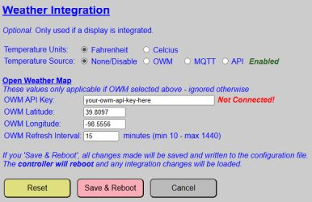
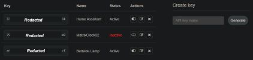

# Setting Up a Weather Source
{: .no_toc }

---

  

Currently, the system only uses temperature data, though future updates may add additional features from external weather sources. While designed for outdoor temperature, you can easily use it for indoor temperature by simply changing the source.

> **💡 Note: Hardware Limitation** The system does not have its own temperature sensor; it simply displays the value it receives from an external source. Until a weather source is configured, the clock will display an initial temperature of **0°**.
{: .note }

To access the weather integration settings, return to **System Integrations** from the primary controller's main web page.

The weather settings are located at the bottom of the System Integrations page.

### Temperature Units and Source
* **Temperature Units:** Select between **°F** or **°C**.
* **Temperature Source:**
    * **None:** Disables the temperature display.
    * **OWM (Open Weather Map):** A free* service using your coordinates for local data. _Requires an internet connection_.
    * **MQTT:** Receives temperature via your MQTT broker. See [MQTT Setup and Topics]({{ '/mqtt' | relative_url }}) for more info.
    * **API:** Updates only when a valid HTTP API command is received. See the [API HTTP Command List]({{ '/api' | relative_url }}) for details.

---

### Open Weather Map Configuration
These settings are only used if **OWM** is selected. You must create an account at [OpenWeatherMap.org](https://openweathermap.org/) to generate an API key.

  

> **⚠️ Important: API Limits and Billing** The system uses the **One Call 3.0 API**. While this is free for up to **1,000 calls per day**, Open Weather Map requires a credit card on file for this tier. If you exceed 1,000 calls in a single day, charges will be incurred. 
{: .important }

To ensure you stay well within the free limit, the system enforces a **minimum refresh interval of 10 minutes** (maximum 144 calls/day).

#### OWM API Key

> 🔍 Generating an API key is a bit of a "quest" that involves signing up for an account and waiting for the key to activate (which can take a few hours). Don't blame the lamp if the key doesn't work instantly—OpenWeatherMap's servers need a little time to realize you’ve joined the party.
{: .note}

Once generated, copy and paste your API key into the OWM API Key field. You can use unique keys for different services (like Home Assistant) to track usage independently, but all calls count towards the 1,000 calls/day limit regardless of key used.

#### OWM Latitude and Longitude
Enter your specific coordinates. If you don't know them, you can find them by clicking your location in Google Maps.

> **⚠️ Important: Negative Coordinates** Depending on your location, your latitude or longitude may be a negative number. You **must** include the negative sign (`-`) in the field or the system will pull weather for the wrong hemisphere.
{: .important }

#### OWM Refresh Interval
This specifies how often the system polls the server. The minimum is **10 minutes** and the maximum is **1,440 minutes** (once per day).

---

### Page Buttons

> **⚠️ Important: Global Impact** Unlike other sections of the web app, the System Integration page buttons **apply to ALL settings on the page simultaneously**. 
{: .important }

* **Reset Button:** Reloads all saved configuration values. This affects OWM settings AND all other system integrations on the page.
* **Save and Reboot Button:** Commits ALL integration settings to the configuration file and reboots the controller. Verify all values on the page (WiFi, MQTT, etc.) before clicking this.
* **Cancel Button:** Discards all changes and returns to the controller's main page.

  <a href="{{ '/time' | relative_url }}" class="btn btn-outline"><- Previous: Clock and Time Settings</a>
  <a href="{{ '/touchsensors' | relative_url }}" class="btn btn-purple">Next: Touch Sensor Configuration -></a>

