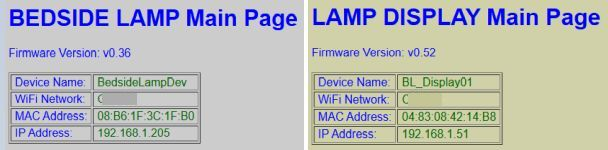
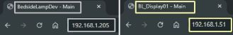
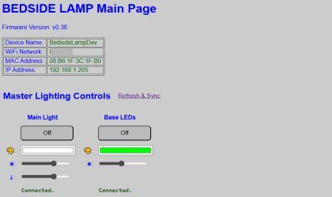
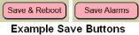
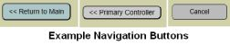
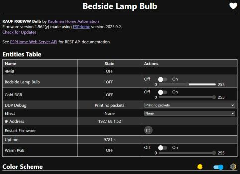

# Web Application Overview
{: .no_toc }

---

  

The web application is the primary interface for the lamp and all its various settings. While the system can be controlled via MQTT, API, or the touch interface, the web application is the **only** interface that provides access to every available setting and option.

> **🌐 Hosted Locally (No Cloud Required)** The entire web interface is served directly from the ESP32's memory. It’s a remarkable feat of engineering when you consider that a chip the size of a postage stamp is doing the work of a web server on top of all its other processing. Just remember that it’s not a supercomputer—if you mash the "Refresh" button like you're trying to win a radio contest, the ESP32 might get a little overwhelmed and take a brief, unscheduled nap.
{: .note }

As covered in [Concepts]({{ '/concepts' | relative_url }}), this project uses three ESP-based controllers. While the app automatically handles most communication behind the scenes, there are specific system commands where you must know which controller you are currently accessing.

### Identifying the "Active" Controller
Because commands can vary by controller, there are several visual indicators to help you identify which interface is currently active in your browser:

* **Information Block:** At the top of every page, the info block lists the specific **Device Name** and **IP Address** you assigned during onboarding.
* **Version Numbers:** Each controller may have different firmware version numbers displayed in the header.
* **Browser Tabs:** The tab in your browser will automatically update to show the device name and IP of the active controller.
* **Interface Color:** For quick visual reference, the **Primary** controller uses a light gray background, while the **Display** controller uses a pale yellow background.

---

### Accessing the Interface
The application is fully responsive and accessible via any modern web browser on your network. 

> **💡 Hint:** For the best experience on a smartphone, rotate your device to **landscape mode**.
{: .note }

To log in, enter the IP address of your **Primary Controller** (e.g., `192.168.1.205`) into your browser's address bar. 

  

---

### Understanding Active vs. Saved Settings
The system manages configuration using a "Dual-State" logic. Understanding this is vital for ensuring your preferences persist after a power outage or reboot.

* **Default Settings:** These are values saved in the configuration file. They are loaded automatically whenever the system boots.
* **Active Settings:** These are values currently in use. If you change a color or brightness level, it becomes "Active" immediately.

> **💡 Persistence Logic** Active settings persist until they are changed again or the system restarts. If the system reboots, it will discard "Active" changes and revert to the "Default" settings. To make an active change permanent, you must click a **Save** or **Save and Reboot** button.
{: .note }

* **Save and Reboot:** The controller writes your current settings to the flash memory and immediately restarts to apply them as the new **Default** values.
* **Other Save Buttons:** Other Save buttons (without '_& reboot_') will save your changes to the appropriate configuration file but do not require a reboot.

---

### General Navigation
The web application manages the "handoff" between controllers automatically. For the best experience, use the **Back**, **Return**, or **Cancel** buttons provided within the web app interface itself. 

Avoid using your browser’s forward/back buttons, as this may load a cached version of the page that doesn't reflect the true current state of the lamp.

---

### Kauf RGBW Bulb Interface
The RGBW bulb runs its own ESPHome-based web interface. Under normal operation, you will **not** need to access this directly, as the Primary Controller handles all bulb commands.

  

If you need to access it for advanced troubleshooting or ESPHome API details, you can navigate directly to the bulb's IP address. For more information on the bulb's native capabilities, refer to the Kauf documentation:

* [Kauf Web Site](https://kaufha.com/blf10/)
* [Kauf GitHub Common Info](https://github.com/KaufHA/common)
* [Kauf GitHub RGBW Bulb Repository](https://github.com/KaufHA/kauf-rgbww-bulbs)

---

  <a href="{{ '/setupmain' | relative_url }}" class="btn btn-outline"><- Previous: Setting Up the System</a>
  <a href="{{ '/display' | relative_url }}" class="btn btn-purple">Next: Main Display -></a>

