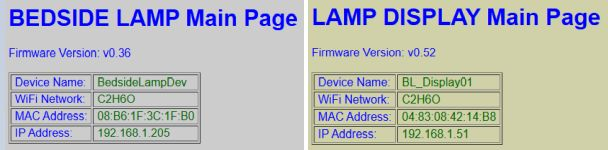
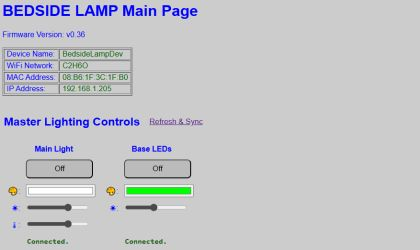

# Web Application Overview

The web application is the main interface to the lamp and all its various settings and features.  While control is available via multiple methods (e.g. MQTT, API, Touch interface, etc.), the web application is the only interface that provides access to every setting and option.    

As covered under [Concepts](/concepts.md), this project uses three ESP-based controllers.  While each controller has its own web interface, you generally just access the web interface for the primary controller and the app will handle interfacing with the correct controller.  However, there are a few special situations where you need to know which controller you are accessing (these are mostly the system commands).  However, you can just tell from a glance which controller is "active" in the web app.  

Looking at the image at the top of this page, you can see the visual indicators that indicate which controller is active.  In addition to different version numbers, the information block at the top lists the device name you assigned to each controller during the [Onboarding](/onboarding.md) process.  Also note the different IP addresses.  What's more, when working with the primary controller, the web page background will appear as light gray.  When working with the display controller, the background will appear as pale yellow.  Finally, the browser tab will show the device name assigned to the active controller along with the IP address.  

**IMPORTANT NOTE**: Note that the web app is being served from one of the two ESP32s.  This is in addition to all the other functions running on the controller.  This means the web pages may experience a bit of a delay in processing.  In other words, don't expect the snappiest response when using the web application.  Most pages should respond in a few seconds (if more than a few seconds have elapsed, you can try clicking the button, link, etc. a second time).  But avoid rapid repeat clicking to try to get a faster response.  This will more likely cue up repeated actions and lead to unexpected results.  Just remember that the ESP32s are doing a lot of work, so web response may be a bit delayed at times.

### Accessing the Web Application

The web application is accessible via a web browser from any device on the same WIFI network as the lamp.  The application is "responsive" so it can be used on phones and tablets as well as computers.

💡Hint: For best results on a phone or smaller display, rotate the device to landscape mode.

To access the web application, simply enter the IP address of the _primary_ controller into the browser address bar.  For example, if your primary controller's IP address is 192.68.1.205, then just enter the IP address into the browser.  After a few seconds, the main web page should appear.

The other sections of this site describe the individual controls and options available via the app.

### Understanding Active vs. Saved Settings
The system utilizes a saved configuration file.  This file contains, among other items, your saved preferences that are applied when the system boots or starts up.  This contains settings such as the LED strip color and state, display brightness, alarm volume, etc.  These are considered the system **DEFAULT** values.  Of course you might use the web application or other control option to toggle the LEDs on and change the color.  These are considered the **ACTIVE** values and will persist until changed again, or until the system restarts, at which point the default settings will be reloaded.

For example:
Say you save the settings (config) so that the LED strip is set to blue at 50% brightness, but with a state of OFF when the system first boots.  These are the **DEFAULT** configuration values.  If you turn the LEDs on (without any other changes), they will intially turn on at 50% brightness with a blue color. 

Now you use the web app to change the color to green at 75% brightness.  These new values are the **ACTIVE** values.  These values are maintained until you either change them again or the system reboots.  Active values will be lost and the default values will be reloaded when this occurs.

As a general rule, if the settings or option section has a "Save" or "Save and Reboot" button, it will write your current settings to the configuation file and these become the new default values.

_Save and Reboot_: If a button shows 'Reboot', then the controller will write your current settings to the saved configuration file, restart and load these new settings as the current **DEFAULT** values.  Just note that the reboot is required and will occur immediately, so assure any other desired settings are not lost before clicking a 'Reboot' button.

### General Navigation Notes
As mentioned above, the web application will properly handle the navigation between controller interfaces and assure you are working with the write controller.  In addtion, most web pages contain a "Back", "Return" or "Cancel" button.  

It is recommended that you use these buttons and avoid use of the browser's back and forward buttons.  When you use the browser's buttons, a cached page may be loaded and the values/states shown may not be current.  Using the app's navigation buttons avoids this potential issue and always forces a page reload so that the data is always current.

### Kauf RGBW Bulb Web Interface (_not used_)

The RGBW bulb has its own web interface.  However, this interface is not used (nor is it needed) as the primary web application will handle all communications with the bulb.

Normally, you should not need to access this page directly beyond the initial onboarding.  However, if you need to access the page for troubleshooting or other uses, you can reach this interface by entering the IP address _of the light bulb_ into a browser from a device on the same WIFI network.  

**NOTE**: This web application _does not_ communicate with the other controllers.  For normal use, you should use the primary web application. See the Kauf documentation for more information on using the bulb's web app or ESPHome API:

[Kauf Web Site](https://kaufha.com/blf10/) 
[Kauf Github Common Information](https://github.com/KaufHA/common) 
[Kauf Github RGBW Bulb Site](https://github.com/KaufHA/kauf-rgbww-bulbs)
